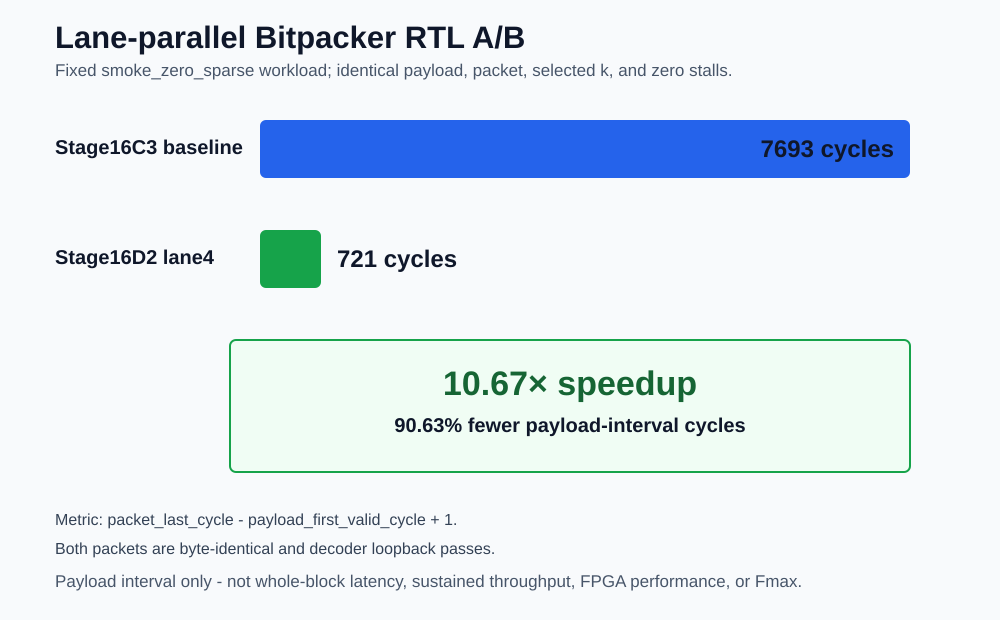

# MRTC-RDTC Scalable Lossless Radar-Tensor Codec IP

[](https://github.com/ichigo-6301/mrtc-radar-tensor-codec-open/actions/workflows/public-preflight.yml)  [](LICENSE)

[中文](README.md) · [Algorithm](docs/en/algorithm.md) · [Architecture](docs/en/architecture.md) · [Verification](docs/en/verification.md) · [Results](docs/en/results.md) · [Immutable RC3](docs/en/release_model.md)

**A streaming lossless codec for OFDM sensing and millimeter-wave radar Range-Doppler tensors, engineered from MATLAB algorithms and synthesizable RTL through Multi-Engine scheduling, FPGA emulation, and ASIC post-route STA.**

RDTC compresses I16Q16 samples block by block while preserving bit-exact reconstruction. A 64-byte self-describing header carries mode, length, and Frame/Block identity so each packet can be stored, transported, and reconstructed independently.


<a id="resume-results"></a>

## 60-Second Overview

| Result | Verified content and applicability | Direct evidence |
|---|---|---|
| Codec and verification | `RAW_BYPASS`, `ZERO_RICE`, and `DELTA_RICE`; `1024` I16Q16 samples/block, a 64-byte header, and 128-bit AXI-Stream; finite-vector MATLAB/C/DPI-C/RTL bit-exact agreement | [Reference validation](evidence/rdtc_v1_reference_validation.yaml) · [verification matrix](docs/en/verification.md) |
| Bitpacker A/B | Fixed historical `smoke_zero_sparse` RTL workload; inclusive first-payload-valid to accepted-packet-`TLAST` interval `7693 -> 721 cycles`, a `10.67×` speedup; not whole-block latency or system throughput | [YAML](evidence/rdtc_v1_bitpacker_pipeline_ab.yaml) · [CSV](evidence/data/rdtc_v1_bitpacker_pipeline_ab.csv) |
| Multi-Engine scaling | Fixed 256-block RTL workload with a simulated DDR feeder; 1/2/4 Engines reach `785 / 397.52 / 197.41 cycles/block`, with 2/4-Engine efficiency `98.7368% / 99.4115%` | [YAML](evidence/rdtc_v1_multiengine_rtl.yaml) · [CSV](evidence/data/rdtc_v1_multiengine_scaling.csv) |
| Direct-AXIS DC A/B | One Nangate45 library, one 315 MHz SDC, two Engines, register-expanded storage, and disabled retiming; cell area/count fall `72.53% / 71.98%`; DC-only architecture A/B | [DC A/B evidence](evidence/rdtc_v1_bounded_buffered_vs_direct_dc_ab.yaml) |
| ASIC post-route STA | Direct register-expanded / eight-macro OpenRAM profiles complete fixed academic post-route PrimeTime setup/hold closure at `600/300 MHz`; not Fmax or foundry signoff | [ASIC evidence](evidence/rdtc_v1_bounded_direct_asic.yaml) · [result matrix](docs/en/results.md) |
| FPGA OOC | Direct-AXIS completes Vivado 2022.2 OOC post-route at 200 MHz on `xc7z100ffg900-2`; WNS `+0.001/+0.062 ns` and `32,672 LUT / 18,519 FF / 0 BRAM`; no bitstream or board-throughput claim | [FPGA evidence](evidence/rdtc_v1_bounded_direct_fpga_ooc200.yaml) |

<p align="center">
  <a href="evidence/rdtc_v1_bitpacker_pipeline_ab.yaml"></a>
</p>
<p align="center">
  <a href="evidence/rdtc_v1_multiengine_rtl.yaml"></a>
</p>

<a id="rtl-reading-path"></a>

## 10-Minute RTL Reading Path

| Order | File | Read for |
|---:|---|---|
| 1 | [`mrtc_top.sv`](rtl/top/mrtc_top.sv) | Start with the complete AXI4-Lite configuration, status, and bidirectional AXIS128 IP boundary. |
| 2 | [`mrtc_rdtc_codec_top.sv`](rtl/rdtc/mrtc_rdtc_codec_top.sv) | See how one Engine integrates the encoder and decoder around shared configuration. |
| 3 | [`mrtc_prefix_k_accum_stream.sv`](rtl/rdtc/mrtc_prefix_k_accum_stream.sv) | Follow ZERO/DELTA prediction, signed-residual mapping, 16 candidate costs, and the `k` reduction tree. |
| 4 | [`mrtc_rice_bitpacker_lane_axis.sv`](rtl/rdtc/mrtc_rice_bitpacker_lane_axis.sv) | Read the lane-parallel quotient/remainder token, normalization, and AXIS128 packing pipeline. |
| 5 | [`mrtc_header_gen.sv`](rtl/rdtc/mrtc_header_gen.sv) · [`mrtc_header_axis_streamer.sv`](rtl/rdtc/mrtc_header_axis_streamer.sv) · [`mrtc_rdtc_decoder_top.sv`](rtl/rdtc/mrtc_rdtc_decoder_top.sv) | Connect the 64-byte header, header/payload framing, and bit-exact reconstruction path. |
| 6 | [`mrtc_rdtc_ddr_multiengine_wrapper.sv`](rtl/rdtc/mrtc_rdtc_ddr_multiengine_wrapper.sv) · [`mrtc_axis_packet_buffer.sv`](rtl/rdtc/mrtc_axis_packet_buffer.sv) | Locate the block dispatcher, per-Engine packet buffers, and output grant held through `tlast`. |
| 7 | [`mrtc_rdtc_bounded_axis_multiengine_wrapper.sv`](rtl/rdtc/mrtc_rdtc_bounded_axis_multiengine_wrapper.sv) | Contrast the final Direct-AXIS dual-Engine job table, ordered packet mux, and bounded output credit. |
| 8 | [`mrtc_dpi_pkg.sv`](tb/dpi/mrtc_dpi_pkg.sv) · [`tb_rdtc_dpi_smoke.sv`](sv/tb_rdtc_dpi_smoke.sv) · [`tb_rdtc_codec_top_smoke.sv`](tb/sv/tb_rdtc_codec_top_smoke.sv) | Inspect the C/DPI-C boundary and the public RTL AXIS128 encode/decode smoke. |

### Choose an integration entrypoint

| Goal | Canonical top | Filelist / check |
|---|---|---|
| Complete AXI4-Lite + AXIS128 IP | [`mrtc_top`](rtl/top/mrtc_top.sv) | [`rdtc_v1.f`](flows/manifests/rdtc_v1.f) · `make integration-smoke` |
| Single-Engine codec datapath | [`mrtc_rdtc_codec_top`](rtl/rdtc/mrtc_rdtc_codec_top.sv) | [`rdtc_v1.f`](flows/manifests/rdtc_v1.f) · `make integration-smoke` |
| Descriptor/DDR Multi-Engine | [`mrtc_rdtc_ddr_multiengine_wrapper`](rtl/rdtc/mrtc_rdtc_ddr_multiengine_wrapper.sv) | [`rdtc_v1_multiengine_smoke.f`](flows/manifests/rdtc_v1_multiengine_smoke.f) · `make multiengine-smoke` |
| Bounded Direct-AXIS dual Engine (opt-in) | [`mrtc_rdtc_bounded_axis_multiengine_wrapper`](rtl/rdtc/mrtc_rdtc_bounded_axis_multiengine_wrapper.sv) | [`rdtc_v1_bounded_direct.f`](flows/manifests/rdtc_v1_bounded_direct.f) · `make bounded-direct-rtl-smoke` |
| Historical Zynq AXIS32 adaptation | [`mrtc_rdtc_axis32_wrapper`](rtl/rdtc/mrtc_rdtc_axis32_wrapper.sv) | [`rdtc_v1_fpga_wrapper_smoke.f`](flows/manifests/rdtc_v1_fpga_wrapper_smoke.f) · `make fpga-wrapper-smoke` |

[See parameters, ports, transactions, and the ordering contract](docs/en/interfaces.md)

<a id="technical-review-path"></a>

## Technical Review Quick Path (No Commercial EDA)

```bash
make rdtc_v1_public_preflight_defconfig
make codec-demo
make -C ref_model/c test
make rtl-smoke
make multiengine-smoke
make bitpacker-pipeline-ab-validate
make bounded-dc-ab-validate
```

The first command creates the public-safe configuration; the next four compile or run published C/RTL entrypoints. The final two only validate sanitized public evidence, identities, and metric contracts; they do not rerun Design Compiler, P&R, or PrimeTime.

<a id="public-scope-provenance"></a>

## Public Scope / Provenance

This repository contains synthesizable RTL, public adaptations, verification entrypoints, and sanitized evidence. It excludes collaborator data, commercial-tool products, PDK payloads, and private system-integration assets. [Public Scope](PUBLIC_SCOPE.md), [Claims](provenance/claims.yaml), [Evidence](provenance/evidence.yaml), and [Nonclaims](provenance/nonclaims.yaml) jointly define the published boundary.

## 1. Algorithm: Why RDTC

The ZERO/DELTA paths map prediction residuals to non-negative integers, evaluate candidate Rice `k` values over each block, and emit a variable-length payload through a lane-parallel bitpacker. Encoder paths that implement fallback retain RAW payload when coding provides no benefit. Mode and fallback behavior remain explicit properties of each integration path rather than an unsupported universal auto-selection claim.

The MATLAB synthetic study compares ZERO_RICE and DELTA_RICE on controlled Range-Doppler-like scenes and checks `NMSE=0`, `max_abs_error=0`, and point-cloud match ratio `1` for the recorded cases. These are not measured radar captures, and PointCloud is not an RTL feature.

Data and boundaries: [algorithm theory and original MATLAB output](docs/en/algorithm.md) · [MATLAB evidence](evidence/rdtc_v1_matlab_algorithm_study.yaml) · [Multi-Engine evidence](evidence/rdtc_v1_multiengine_rtl.yaml)

## 2. Architecture: Single Engine to Multi-Engine

A Single Engine combines a ping-pong block buffer, predictor/residual mapper, prefix-cost and `k` selection, lane-parallel bitpacker, header generator, packet buffer, and decoder. Input capture overlaps current-block computation, while the packet buffer isolates variable-length encoding from AXI backpressure.

The parameterized Multi-Engine wrapper dispatches whole blocks round-robin and locks an output packet through `tlast`, preventing beat interleaving within a packet. Completion order remains data-dependent and is not guaranteed. Frame/Block metadata provides an indexed software-reconstruction interface; this repository does not claim a software reorder program PASS or turn an unobserved reorder event into a verification result.

The new opt-in Direct-AXIS profile removes the DDR feeder and per-Engine payload commit stores. It retains two Engines with four `32x128` 1RW ways each, a two-entry job table, and one global 16-beat output FIFO. Its domain is fixed to `ZERO_RICE + prefix-128 adaptive k`, with every Rice word constrained to `<=128 bits`. Output-credit exhaustion is sticky fatal and may expose a partial packet. Recorded ordered packet service is about `277 cycles/block`, above the `256 cycles/block` zero-gap arrival interval, so sustained zero-stall operation is not claimed.

[See the Single-Engine pipeline, Multi-Engine wrapper, and ordering contract](docs/en/architecture.md)

## 3. Verification: One Bitstream Contract Across Layers

```text
MATLAB synthetic study
        -> C reference model
        -> DPI-C / SystemVerilog bit-exact comparison
        -> Multi-Engine packet and backpressure regression
        -> FPGA emulation boundary
        -> ASIC P&R / same-run SPEF / PrimeTime
```

Public smoke tests cover the C reference model, RTL loopback, packet boundaries, `tkeep/tlast`, randomized backpressure, Multi-Engine arbitration, and the AXIS32 wrapper. The public Icarus-compatible checks are portability/elaboration gates, not substitutes for ModelSim or Vivado evidence. Passing finite vectors and regressions is not formal exhaustiveness or coverage closure.

A fixed visible demo invokes the published C encoder and decoder: a 1024-sample `delta_smooth` input selects `DELTA_RICE` with `k=0`, produces a 360-byte self-describing packet from 4096 raw bytes, and reconstructs the original I/Q bytes exactly with `RDTC_CODEC_DEMO_PASS`. Input, packet, and decoded-output hashes are recorded in the [codec demo evidence](evidence/rdtc_v1_codec_demo.yaml).

[See the verification matrix and reproducible entrypoints](docs/en/verification.md)

## 4. FPGA: Layered Maturity

**FPGA emulation verified** still refers specifically to the fixed-source Vivado 2018.3 AXIS32 XSim `3/3` result from a single-`s0` testbench. Separately, the Direct-AXIS profile completes Vivado 2022.2 OOC post-route at 200 MHz on `xc7z100ffg900-2`: setup/hold WNS is `+0.001/+0.062 ns`, the structure contains two Engines, eight ways, and `1024 x RAM32X1S`, and utilization is `32,672 LUT / 18,519 FF / 0 BRAM`. This is an internal OOC fixed closure point, not Fmax, and it makes no bitstream, board-console, MCDMA/DDR runtime, or measured-throughput claim.

[See FPGA emulation and Zynq integration boundaries](docs/en/fpga_implementation.md)

## 5. ASIC: Architecture DC A/B and Post-Route STA

### Same-Constraint Architecture A/B (DC-only)

Under one Nangate45 typical library, one 315 MHz synchronous-boundary SDC, two Engines, register-expanded storage, `compile_ultra`, and disabled retiming, the buffered wrapper reports `1,529,495.20 um2 / 786,342 cells`; Direct-AXIS reports `420,208.44 um2 / 220,298 cells`. Removing the DDR feeder and per-Engine payload commit stores therefore reduces DC cell area by `72.53%` and cell count by `71.98%`. This is an architecture-level synthesis comparison, not SRAM-macro area, post-route area, power, or Fmax.

### Post-Route Closure Points

**The frequency closure points below come from PrimeTime setup/hold STA after routing, not from the DC A/B estimate.** STA uses the matching routed netlist, SDC, and same-run OpenRCX SPEF; DC supplies only the mapped netlist handed to physical implementation.

| Profile | Verified implementation result | Maturity boundary |
|---|---|---|
| `rdtc_v1_register_nangate45_550` | 550 MHz OpenROAD P&R + same-run OpenRCX SPEF + PrimeTime; configured die/core `1200 x 1200 um` / `1159.72 x 1155.20 um`; core area `421,120 um2`; route DRC `0`; antenna net/pin `0/0`; setup/hold WNS `+0.26/+0.04 ns` | internal register-to-register implementation/timing verified |
| `rdtc_v1_sram_nangate45_333` | Two `64x128 1RW1R` OpenRAM macros; 333 MHz chip-level P&R + same-run SPEF + internal PT; configured die/core `1200 x 1200 um` / `1159.72 x 1155.20 um`; route DRC `0`; antenna net/pin `0/0`; setup/hold WNS `+0.57/+0.04 ns` | chip-level P&R and internal timing verified; the academic Nangate45/OpenRAM platform makes no production-PDK, macro-signoff, or silicon-readiness claim; the 256-endpoint exact-set waiver remains separately disclosed |
| `rdtc_v1_bounded_direct_register_expanded` | Direct-AXIS, two Engines, `32,768` ring bits expanded to registers, zero macros; 600 MHz P&R + OpenRCX + PT; route DRC/antenna `0/0`; setup/hold WNS `+0.03/+0.02 ns` | fixed academic internal closure point; not Fmax or sustained zero-stall evidence |
| `rdtc_v1_bounded_direct_sram_macro` | Direct-AXIS with eight `32x128 1RW` OpenRAM macros; 300 MHz P&R + OpenRCX + PT; route DRC/antenna `0/0`; setup/hold WNS `+0.16/+0.02 ns` | top-level implementation and internal timing verified; macro DRC/LVS/PEX remains open; 600 MHz is `MACRO_MODEL_BLOCKED` |

These frequencies are fixed verified closure points for the stated profiles, not maximum frequencies. They remain inside the academic PDK/OpenRAM implementation scope and do not claim complete top-level IO timing, OCV/MMMC, foundry signoff, or silicon readiness.

[See the ASIC flow contract](docs/en/asic_implementation.md) · [DC A/B evidence](evidence/rdtc_v1_bounded_buffered_vs_direct_dc_ab.yaml) · [complete result matrix](docs/en/results.md) · [limitations and nonclaims](docs/en/limitations.md)

## Complete Public Gate

```bash
make rdtc_v1_public_preflight_defconfig
make public-preflight
make bounded-dc-ab-validate
```

This gate aggregates published C/RTL smoke tests, documentation, schemas, identities, checksums, assets, and leakage scans; `bounded-dc-ab-validate` remains evidence-only. Configured Questa/ModelSim environments can additionally run `make sim` and `make sim-full`. Commercial-tool, PDK, library, and macro paths are allowed only in ignored `flows/local/` files.

## Documentation and Release Boundary

[Interfaces](docs/en/interfaces.md) · [Bitstream format](docs/en/bitstream_format.md) · [Register map](docs/en/register_map.md) · [Public release model](docs/en/release_model.md) · [Evidence index](provenance/evidence.yaml) · [Claims](provenance/claims.yaml)

This showcase is a post-RC3 presentation update. The immutable annotated tag `rdtc-v1-register550-rc3` still identifies the original `register550-rc3` release and is not moved or recreated by documentation or public-adaptation changes.
