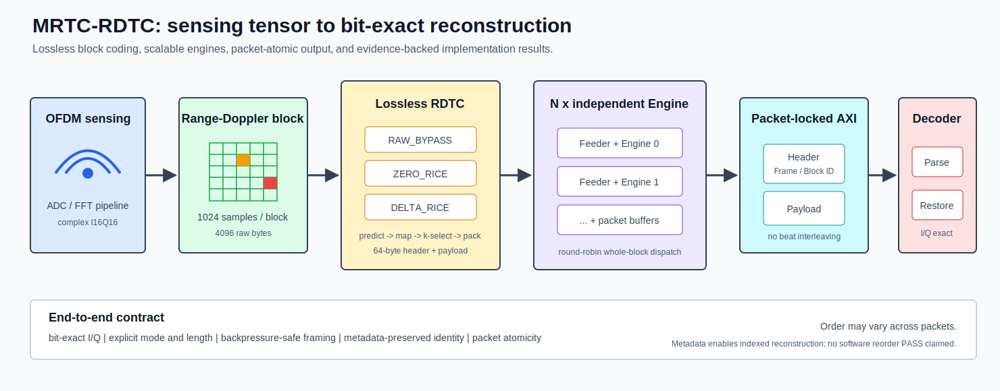

# MRTC-RDTC 可扩展雷达张量无损编解码 IP

[English](README.en.md) · [算法](docs/zh-CN/algorithm.md) · [架构](docs/zh-CN/architecture.md) · [验证](docs/zh-CN/verification.md) · [结果](docs/zh-CN/results.md) · [不可变 RC3](docs/zh-CN/release_model.md)

**面向 OFDM 通感与毫米波雷达 Range-Doppler 张量的流式无损压缩器：从 MATLAB 算法、可综合 RTL 和 Multi-Engine 调度，一直验证到 FPGA emulation 与 ASIC post-route STA。**

RDTC 以 block 为单位压缩 I16Q16 样本，在保持 bit-exact 恢复的同时降低片外 DDR 与链路流量；64-byte self-describing header 保留模式、长度和 Frame/Block 身份，使 packet 可独立存储、传输与恢复。



## 60 秒总览

| 维度 | 已实现与已验证内容 |
|---|---|
| 无损算法 | `RAW_BYPASS`、`ZERO_RICE`、`DELTA_RICE`；I/Q bit-exact reconstruction |
| 单 Engine | `1024` 个 I16Q16 sample/block，`4096` byte raw，64-byte header，128-bit AXI-Stream |
| Multi-Engine | Round-Robin block dispatch、独立 feeder/codec/packet buffer、packet-locked arbitration |
| RTL 吞吐 | 1/2/4 Engine：`785 / 397.52 / 197.41 cycles/block`，固定 256-block simulation workload |
| FPGA | 固定 commit、single-`s0` 的 Vivado 2018.3 AXIS32 XSim `3/3` PASS；Zynq trial 仅 compatibility-copied RTL elaboration + SDK/ELF build |
| ASIC | Nangate45 register-expanded 550 MHz；双 OpenRAM SRAM-macro 333 MHz；两者实现/内部时序为 fixed verified closure point，SRAM overall profile 仍为 partial |

## 1. 算法：为什么选择 RDTC

ZERO/DELTA 路径把预测残差映射为非负整数，在 block 内评估候选 Rice `k`，再由 lane-parallel bitpacker 输出变长 payload。支持 fallback 的 encoder path 会在编码无收益时保留 RAW payload；模式与 fallback 边界由具体集成路径决定，不被包装成未经证明的自动算法选择器。

MATLAB synthetic study 在受控 Range-Doppler-like 场景中比较 ZERO_RICE 与 DELTA_RICE，并对记录用例检查 `NMSE=0`、`max_abs_error=0` 和 point-cloud match ratio `1`。这些数据不是实测雷达采集，PointCloud 也不是 RTL 功能。

<p align="center">
  
  
</p>

数据与边界：[算法理论及 MATLAB 原图](docs/zh-CN/algorithm.md) · [MATLAB evidence](evidence/rdtc_v1_matlab_algorithm_study.yaml) · [Multi-Engine evidence](evidence/rdtc_v1_multiengine_rtl.yaml)

## 2. 架构：从单 Engine 到 Multi-Engine

单 Engine 由 ping-pong block buffer、predictor/residual mapper、prefix cost 与 `k` selection、lane-parallel bitpacker、header generator、packet buffer 和 decoder 构成。输入捕获可与当前 block 计算重叠，packet buffer 则隔离变长编码与 AXI backpressure。

参数化 Multi-Engine wrapper 按 block Round-Robin 分发任务，并锁定一个输出 packet 直到 `tlast`，因此 packet 内不会发生 beat interleaving。完成顺序由数据相关压缩延迟决定且不保证；Frame/Block metadata 只提供 indexed software reconstruction 接口，本仓库不声明软件 reorder 程序 PASS，也没有把未直接观察到的乱序事件写成验证结果。

[查看单 Engine pipeline、Multi-Engine wrapper 与 ordering contract](docs/zh-CN/architecture.md)

## 3. 验证：同一个码流合同贯穿各层

```text
MATLAB synthetic study
        -> C reference model
        -> DPI-C / SystemVerilog bit-exact comparison
        -> Multi-Engine packet and backpressure regression
        -> FPGA emulation boundary
        -> ASIC P&R / same-run SPEF / PrimeTime
```

公开 smoke 覆盖 C reference、RTL loopback、packet 边界、`tkeep/tlast`、随机 backpressure、Multi-Engine 仲裁以及 AXIS32 wrapper。有限向量与 regression PASS 不等于形式穷尽或 coverage closure。

[查看验证矩阵与可复现入口](docs/zh-CN/verification.md)

## 4. FPGA：分层陈述成熟度

**FPGA emulation verified.** 固定 source commit `43deb9f` 上的 Vivado 2018.3 AXIS32 wrapper XSim 用例 `3/3` 通过，覆盖真实 encoder/decoder 路径、宽度转换、变长 packet、`tkeep/tlast`、输入 gap 与输出 backpressure。该 testbench 只驱动 `s0`；双 Engine 扩展由独立 RTL regression 支撑。公开 Icarus-compatible wrapper/testbench 是历史 source 的 adaptation，不构成新的 Vivado 结果，也不声明当前公开 RTL 可直接在 Vivado 2018.3 elaboration。Zynq-7000 trial 只声明 compatibility-copied RTL elaboration 与 SDK/ELF build，不声明 matching bitstream、板上 console PASS、MCDMA/DDR runtime、FPGA timing 或资源结果。

[查看 FPGA emulation 与 Zynq 集成边界](docs/zh-CN/fpga_implementation.md)

## 5. ASIC：固定闭合点，不写成 Fmax

| Profile | Verified implementation result | Maturity boundary |
|---|---|---|
| `rdtc_v1_register_nangate45_550` | 550 MHz OpenROAD P&R + same-run OpenRCX SPEF + PrimeTime；core area `421,120 um2`；route DRC `0`；antenna net/pin `0/0`；setup/hold WNS `+0.26/+0.04 ns` | internal reg-to-reg implementation/timing verified |
| `rdtc_v1_sram_nangate45_333` | 双 `64x128 1RW1R` OpenRAM macro；333 MHz 芯片级 P&R + same-run SPEF + internal PT；route DRC `0`；antenna net/pin `0/0`；setup/hold WNS `+0.57/+0.04 ns` | 实现链 verified；整体 profile 因 analytical macro model 与 macro DRC/LVS/PEX 未闭合而保持 partial；256-endpoint exact-set waiver 单独披露 |

这些频率是对应 profile 的 fixed verified closure point，不是 maximum frequency。结果属于 academic implementation evidence，不声明完整 top-level IO timing、OCV/MMMC、foundry signoff 或 silicon readiness。

[查看 ASIC flow contract](docs/zh-CN/asic_implementation.md) · [完整结果矩阵](docs/zh-CN/results.md) · [限制与未声明项](docs/zh-CN/limitations.md)

## 快速复现

```bash
make rdtc_v1_public_preflight_defconfig
make -C ref_model/c test
make rtl-smoke
make multiengine-smoke
make fpga-wrapper-smoke
make showcase-assets-check
```

Questa/ModelSim 环境可继续运行 `make sim` 与 `make sim-full`。商业工具、PDK、library 和 macro 路径仅允许出现在 ignored `flows/local/`。

## 文档与发行边界

[接口](docs/zh-CN/interfaces.md) · [码流格式](docs/zh-CN/bitstream_format.md) · [寄存器](docs/zh-CN/register_map.md) · [公开发行模型](docs/zh-CN/release_model.md) · [Evidence 索引](provenance/evidence.yaml) · [Claims](provenance/claims.yaml)

当前 showcase 是 RC3 之后的展示更新；不可变 annotated tag `rdtc-v1-register550-rc3` 仍固定原始 `register550-rc3` 发行，不因文档和公开适配更新而移动或重建。
