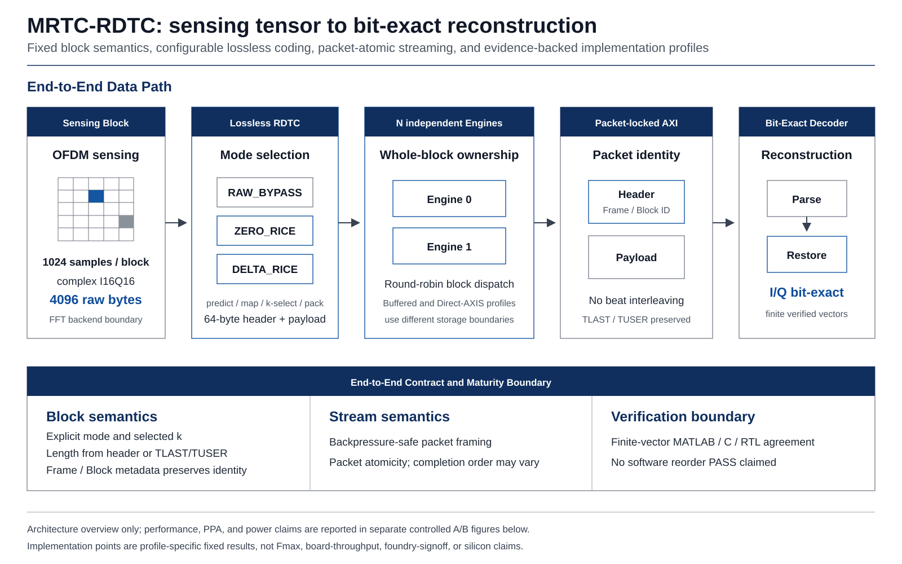
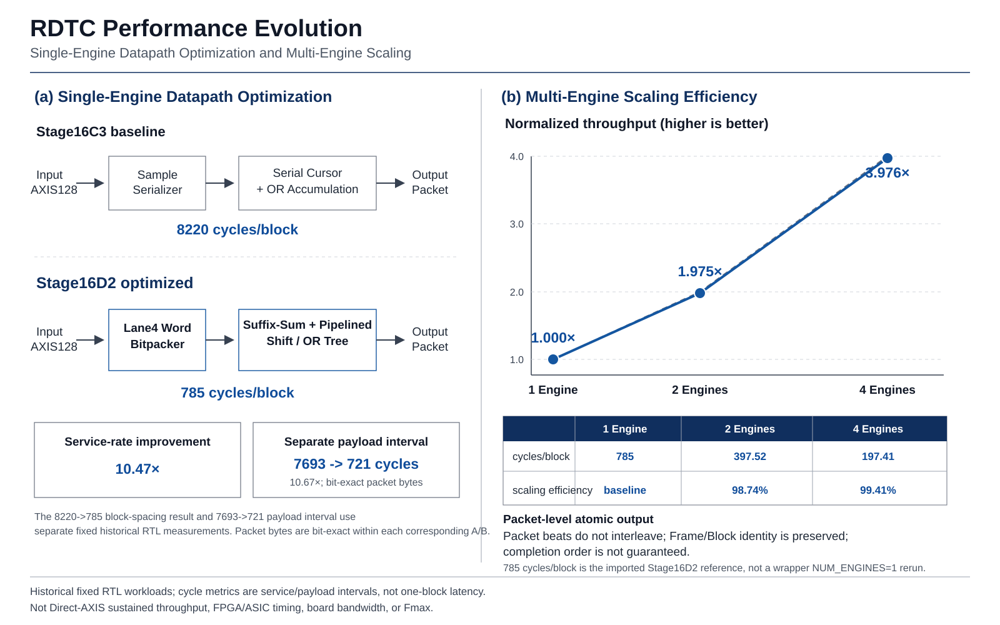
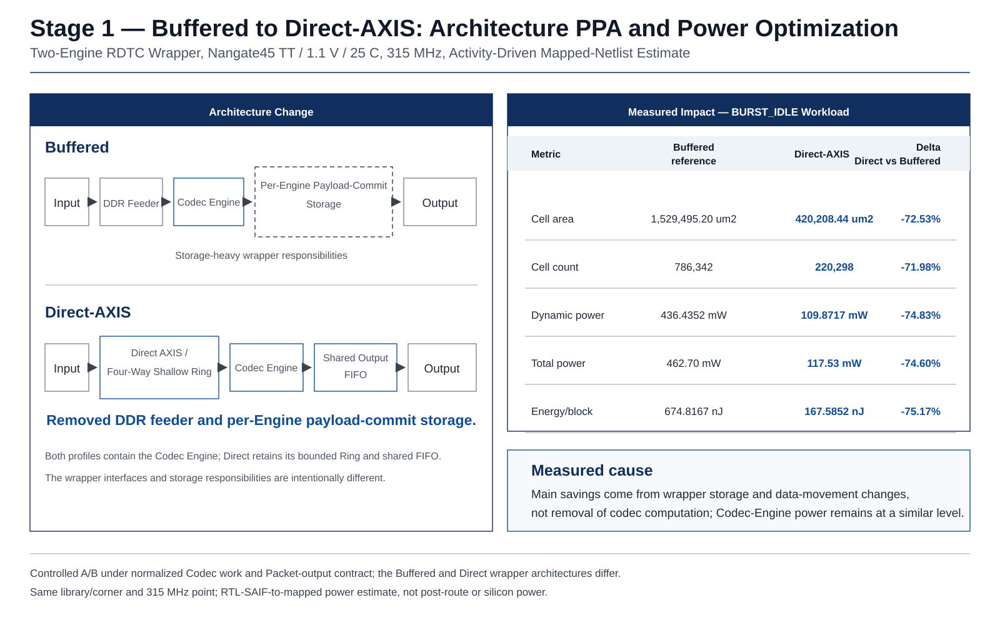
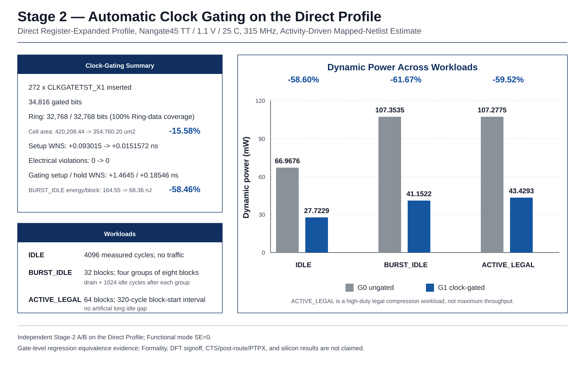

# MRTC-RDTC 可扩展雷达张量无损编解码 IP

[](https://github.com/ichigo-6301/mrtc-radar-tensor-codec-open/actions/workflows/public-preflight.yml)  [](LICENSE)

[English](README.en.md) · [算法](docs/zh-CN/algorithm.md) · [架构](docs/zh-CN/architecture.md) · [验证](docs/zh-CN/verification.md) · [结果](docs/zh-CN/results.md) · [不可变 RC3](docs/zh-CN/release_model.md)

**面向 OFDM 通感与毫米波雷达 Range-Doppler 张量的流式无损压缩器：从 MATLAB 算法、可综合 RTL 和 Multi-Engine 调度，一直验证到 FPGA emulation 与 ASIC post-route STA。**

RDTC 以 block 为单位压缩 I16Q16 样本，在保持 bit-exact 恢复的同时降低片外 DDR 与链路流量；常规 packet 的 64-byte self-describing header 保留模式、长度和 Frame/Block 身份，bounded Direct packet 则以 TLAST/TUSER 给出物理长度。

硬件实现与性能优化以 Encoder/压缩数据面为主，消费端可由 PC/C decoder 恢复常规 header-length packet。RTL decoder 用于协议闭环、bit-exact loopback 与硬件解码参考；本仓不声明生产 ASIC 必须实例化 decoder。



<a id="resume-results"></a>

## 60 秒总览

| 贡献 | 量化结果 | Profile / 边界 | 直接 Evidence |
|---|---|---|---|
| 三模式 AXIS128 codec 与验证链 | `RAW_BYPASS`、`ZERO_RICE`、`DELTA_RICE`；`1024` 个 I16Q16 sample/block、64-byte header；MATLAB/C/DPI-C/RTL 有限向量 bit-exact | 编码器/压缩数据面为主；RTL decoder 用于 loopback 与协议闭环 | [Reference validation](evidence/rdtc_v1_reference_validation.yaml) · [验证矩阵](docs/zh-CN/verification.md) |
| RTL 性能演进 | Bitpacker payload interval `7693 -> 721 cycles`（`10.67×`）；历史单 Engine spacing `8220 -> 785 cycles/block`（`10.47×`），1/2/4 Engine 为 `785 / 397.52 / 197.41 cycles/block` | 前者是 payload interval；后者是历史 buffered service-rate，`785` 为 Stage16D2 导入 reference；都不是 Direct 持续吞吐或 Fmax | [Bitpacker YAML](evidence/rdtc_v1_bitpacker_pipeline_ab.yaml) · [CSV](evidence/data/rdtc_v1_bitpacker_pipeline_ab.csv) · [Multi-Engine YAML](evidence/rdtc_v1_multiengine_rtl.yaml) · [CSV](evidence/data/rdtc_v1_multiengine_scaling.csv) |
| Direct-AXIS 架构与 Stage-1 PPA/功耗 | 删除 DDR feeder 与 per-Engine payload commit；315 MHz DC cell area/count 减少 `72.53% / 71.98%`；BURST_IDLE dynamic `436.4352 -> 109.8717 mW`（`-74.83%`） | 双 Engine、全寄存器；Direct RTL 约 `~277 > 256 cycles/block`；Stage 1 使用独立 RTL-SAIF-to-mapped activity，属于 mapped estimate | [Direct RTL](evidence/rdtc_v1_bounded_direct_rtl.yaml) · [流时序](evidence/rdtc_v1_direct_stream_timing_trace.yaml) · [DC A/B](evidence/rdtc_v1_bounded_buffered_vs_direct_dc_ab.yaml) · [Stage-1 Evidence](evidence/rdtc_v1_power_architecture_ab/README.md) · [方法](docs/zh-CN/asic_power_experiment.md) |
| Direct G0/G1 自动时钟门控 A/B | 315 MHz cell area `420,208.442440 -> 354,760.204745 um2`（`-15.58%`）；BURST_IDLE dynamic `107.3535 -> 41.1522 mW`（`-61.67%`），energy/block `164.55 -> 68.36 nJ`（`-58.46%`）；ACTIVE_LEGAL dynamic `107.2775 -> 43.4293 mW`（`-59.52%`） | 独立 Stage 2；272 个 ICG、34,816 gated bits、mapped GLS activity；只相对 Direct G0，不与 Stage 1 百分比相加 | [Evidence package](evidence/rdtc_v1_clock_gating_mapped_dc/README.md) · [方法与边界](docs/zh-CN/asic_clock_gating_experiment.md) |
| FPGA / ASIC 落地边界 | Direct FPGA OOC 200 MHz；Direct register-expanded / 8-macro OpenRAM 分别在 `600/300 MHz` 完成 fixed academic post-route PrimeTime setup/hold 闭合 | FPGA 不声明 bitstream/板级吞吐；ASIC 频率不是 Fmax 或 foundry signoff | [FPGA evidence](evidence/rdtc_v1_bounded_direct_fpga_ooc200.yaml) · [ASIC evidence](evidence/rdtc_v1_bounded_direct_asic.yaml) · [结果矩阵](docs/zh-CN/results.md) |

## 性能、PPA 与低功耗演进

<p align="center">
  <a href="docs/assets/rdtc_performance_evolution.svg"></a>
</p>

Figure 1 分开呈现固定 `smoke_zero_sparse` 的 Bitpacker payload interval 与历史 buffered Multi-Engine service-rate；完成顺序不保证，且 simulated DDR feeder、假设 200 MHz 与 RTL simulation projection 都不是已实现环境或板级吞吐。机器来源为 [Bitpacker YAML](evidence/rdtc_v1_bitpacker_pipeline_ab.yaml)、[Bitpacker CSV](evidence/data/rdtc_v1_bitpacker_pipeline_ab.csv)、[Multi-Engine YAML](evidence/rdtc_v1_multiengine_rtl.yaml) 与 [Multi-Engine CSV](evidence/data/rdtc_v1_multiengine_scaling.csv)。

<p align="center">
  <a href="docs/assets/rdtc_stage1_architecture_ppa_power.svg"></a>
</p>
<p align="center">
  <a href="docs/assets/rdtc_stage2_clock_gating_power.svg"></a>
</p>

Figure 2 与 Figure 3 是 baseline 不同的独立 A/B：Stage 1 比较 Buffered 与 Direct-AXIS，activity 方法为 RTL-SAIF-to-mapped；Stage 2 固定 Direct 架构，只比较 G0/G1，使用 mapped zero-delay GLS activity、功能态 SE=0。两阶段百分比不得相加。Activity Annotation Coverage 不是验证 test coverage。机器来源见 [Stage-1 Evidence package](evidence/rdtc_v1_power_architecture_ab/README.md) 与 [Stage-2 Evidence package](evidence/rdtc_v1_clock_gating_mapped_dc/README.md)。这里不声明 CTS clock-tree 或 PrimeTime-PX 功耗、Formality、DFT/scan、silicon measurement 或 foundry signoff、Fmax，也不把固定 workload 的结果推广为 workload-universal saving。

### FPGA / ASIC 实现闭环

| 固定 closure profile | 已核验固定点 | 直接 Evidence | 边界 |
|---|---|---|---|
| Direct FPGA OOC | 200 MHz；setup/hold WNS `+0.001/+0.062 ns`；`32,672 LUT / 18,519 FF / 0 BRAM` | [FPGA 200 MHz evidence](evidence/rdtc_v1_bounded_direct_fpga_ooc200.yaml) | OOC internal timing；无 bitstream、board IO、板级吞吐或 Fmax claim |
| Direct register-expanded ASIC | 600 MHz；0 memory macro；standard-cell area `476,320 um2`；PT setup/hold WNS `+0.03/+0.02 ns` | [Register-expanded ASIC 600 MHz evidence](evidence/rdtc_v1_bounded_direct_asic.yaml) | fixed academic internal closure；非完整 IO、foundry signoff 或 Fmax |
| Direct 8-macro OpenRAM ASIC | 300 MHz；8 个 `32x128 1RW` 宏；PT setup/hold WNS `+0.16/+0.02 ns` | [8-macro OpenRAM ASIC 300 MHz evidence](evidence/rdtc_v1_bounded_direct_asic.yaml) | 顶层闭合；macro DRC/LVS/PEX 未闭合，600 MHz 为 `MACRO_MODEL_BLOCKED` |

三行是 profile-specific 固定点，不用于跨 FPGA、register-expanded ASIC 与 SRAM-macro ASIC 排名。

<a id="data-contract"></a>

## 数据合同：4096B 原始 Block 如何变成变长 Packet

```text
FFT backend output: S[beam][doppler][range]  (range fastest)
                              |
                              v
+----------------------------------------------------------------+
| 1 block = 1 beam x 64 Doppler x 16 Range                      |
|         = 1024 I16Q16 complex samples = 4096 B                |
+----------------------------------------------------------------+
                              |
                              | 256 AXIS128 beats
                              | 4 complex samples / beat
                              v
+-------------+------------+------------+-------------------------+
| Predictor   | Signed map | Adaptive k | Rice bitpacker          |
+-------------+------------+------------+-------------------------+
                              |
                              v
+----------------------+-----------------------------------------+
| 64 B header          | Variable-length payload                 |
| 4 AXIS128 beats      | N AXIS128 beats                         |
+----------------------+-----------------------------------------+
                                                 final TLAST/TUSER
                              |
                  +-----------+-----------+
                  |                       |
                  v                       v
       DDR / interconnect / 10G     RTL decoder
                  |                 loopback / reference
                  v
       PC/C decoder (header-length packet)
       restores the original I/Q samples
```

### 一拍 AXIS128 如何变成变长 Rice Fragment

```text
Bounded Direct: one AXIS128 beat -> one variable-length fragment

AXIS128 = 4 x I16Q16 = 8 x signed 16-bit components
                 | first 32 accepted beats        | every source beat
                 v                                v
       cost for k=0..15 -> selected k*   ZERO predict -> residual r
                              |                    |
                              |          signed map -> m
                              +---------+----------+
                                        v
                                q = m >> k*
                                rem = m[k*-1:0]
                                Rice = 1^q | 0 | rem
                                        |
                                        v
                         concatenate I0,Q0,...,I3,Q3
                                        |
                         word_bits = sum(q+1+k*) <= 128 ?
                                  |                         |
                                 yes                       no
                                  |                         |
                                  v                         v
                    variable-length fragment            fail-stop
                                  |
                                  v
                    bit reservoir -> AXIS128 payload
```

- `1^q` 表示连续 `q` 个 `1`；quotient 以 unary count 编码，不输出固定 18-bit 二进制字段。终止 `0` 让 Decoder 无需额外 quotient-width metadata 就能恢复 `q`；`rem` 是 mapped value 的低 `k*` bit。
- `word_bits <= 128` 是每个 128-bit source word 的局部 bounded guard，不是整个 Payload 或 Packet 的长度限制；违反时报告 `MRTC_ERR_BOUNDED_RICE_WORD` 并 fail-stop，不自动 fallback 到 RAW。
- 前 32 个已接收 beat 包含 128-sample prefix，estimator 用每个 I/Q component 的 `q+1+k` 代价在 `k=0..15` 中选择累计代价最小的 `k*`。这些 beat 仍保存在 ring 中；`k*` 有效后，Bitpacker 仍按原序读取并编码全部 256 个 source word，包括前 32 拍。
- 八个 component code 按 `I0,Q0,...,I3,Q3` 直接连接；fragment 之间不做 byte alignment，width-packer reservoir 连续拼接 bit。source read `II=1` 不等于 compressed AXIS `TVALID` 每周期有效。
- 若 256 个 source word 都满足该 guard，coded payload 的数学上界为 `256 x 128 bit = 4096 B`；packet 还要加固定 64-byte header。这不是 packet 必然压缩或输出带宽必然更低的声明。

- Producer 按 `S[spatial/beam, doppler, range]` 扁平化，Range 最快变化；RTL 接收扁平序列，不实现上游 FFT。
- 每个 sample 是 `{Q[15:0], I[15:0]}`，一个 AXIS128 beat 按 lane 顺序携带 4 个 sample。
- 默认 block 为 `1024 sample = 4096 B = 256 beats`，输入 TLAST 位于零起始 beat 255。

`packet = 4 个 128-bit header beat + 变长 payload beat`，物理尾拍由 TLAST/TUSER 描述。

**固定 `delta_smooth` 示例：** `4096 B raw -> 64 B Header + 296 B Payload（2365 payload bit）= 360 B / 23 AXIS128 beat`，C Decoder 恢复后 I/Q 与输入逐比特一致。

| 握手 / framing | 合同 |
|---|---|
| 输入 | `256` 个完整 AXIS128 beat；`s_axis_raw_tlast` 位于 beat `255` |
| 输出 | 固定 `4` 个 header beat，后接变长 payload；`m_axis_comp_tlast` 只在 packet 末拍置位 |
| 尾拍 | `m_axis_comp_tuser[3:0] = valid_byte_count - 1`；主 AXIS128 不使用 TKEEP |
| Backpressure | 正常非 fatal 路径中 `TVALID=1, TREADY=0` 时，`TDATA/TUSER/TLAST` 保持稳定 |

当前 C Decoder 直接支持常规 header-length packet；bounded Direct 的 `STREAM_LENGTH_BY_TLAST` packet 仍需接收侧长度适配，详细边界见码流格式页。

[查看 raw lane 与 packet wire layout](docs/zh-CN/bitstream_format.md#raw-axis-layout) · [查看 64-byte header、payload 与长度合同](docs/zh-CN/bitstream_format.md#header-layout) · [查看 Direct 四路浅输入 ring](docs/zh-CN/architecture.md#four-way-shallow-input-ring) · [查看 beat-to-fragment 流水](docs/zh-CN/architecture.md#beat-to-rice-fragment) · [查看真实流时序与握手](docs/zh-CN/stream_timing.md#direct-engine0-trace)

### 选择集成入口

| 目标 | Canonical top | Filelist / 检查 |
|---|---|---|
| 完整 AXI4-Lite + AXIS128 IP | [`mrtc_top`](rtl/top/mrtc_top.sv) | [`rdtc_v1.f`](flows/manifests/rdtc_v1.f) · `make integration-smoke` |
| 单 Engine codec datapath | [`mrtc_rdtc_codec_top`](rtl/rdtc/mrtc_rdtc_codec_top.sv) | [`rdtc_v1.f`](flows/manifests/rdtc_v1.f) · `make integration-smoke` |
| Bounded Direct-AXIS 双 Engine（opt-in） | [`mrtc_rdtc_bounded_axis_multiengine_wrapper`](rtl/rdtc/mrtc_rdtc_bounded_axis_multiengine_wrapper.sv) | 固定 `ZERO_RICE + prefix-128`；[`rdtc_v1_bounded_direct.f`](flows/manifests/rdtc_v1_bounded_direct.f) · `make bounded-direct-rtl-smoke` |
| 历史 Zynq AXIS32 adaptation | [`mrtc_rdtc_axis32_wrapper`](rtl/rdtc/mrtc_rdtc_axis32_wrapper.sv) | [`rdtc_v1_fpga_wrapper_smoke.f`](flows/manifests/rdtc_v1_fpga_wrapper_smoke.f) · `make fpga-wrapper-smoke` |

Direct profile 是最终双 Engine 的 bounded input 合同；producer 必须先完成 descriptor 预约并在 wrapper 允许的 ready 窗口送数，不能把 `TVALID && !TREADY` 当作可无限保持的普通输入 backpressure。

<a id="rtl-reading-path"></a>

## 10 分钟代码阅读路径

| 顺序 | 文件 | 阅读重点 |
|---:|---|---|
| 1 | [`mrtc_top.sv`](rtl/top/mrtc_top.sv) | 从 AXI4-Lite 配置、状态寄存器和双向 AXIS128 端口理解完整 IP 边界。 |
| 2 | [`mrtc_rdtc_codec_top.sv`](rtl/rdtc/mrtc_rdtc_codec_top.sv) | 查看单 Engine encoder/decoder 如何共享配置并形成 loopback datapath。 |
| 3 | [`mrtc_prefix_k_accum_stream.sv`](rtl/rdtc/mrtc_prefix_k_accum_stream.sv) | 跟踪 ZERO/DELTA 预测、signed residual 映射、16 个候选代价累加与 `k` reduction。 |
| 4 | [`mrtc_rice_bitpacker_lane_axis.sv`](rtl/rdtc/mrtc_rice_bitpacker_lane_axis.sv) | 阅读 lane-parallel quotient/remainder token 生成、归一化和 AXIS128 拼接流水。 |
| 5 | [`mrtc_header_gen.sv`](rtl/rdtc/mrtc_header_gen.sv) · [`mrtc_header_axis_streamer.sv`](rtl/rdtc/mrtc_header_axis_streamer.sv) · [`mrtc_rdtc_decoder_top.sv`](rtl/rdtc/mrtc_rdtc_decoder_top.sv) | 串起 64-byte header、header/payload framing 与 bit-exact 解码恢复。 |
| 6 | [`mrtc_rdtc_ddr_multiengine_wrapper.sv`](rtl/rdtc/mrtc_rdtc_ddr_multiengine_wrapper.sv) · [`mrtc_axis_packet_buffer.sv`](rtl/rdtc/mrtc_axis_packet_buffer.sv) | 定位 block dispatcher、per-Engine packet buffer 与锁定到 `tlast` 的输出仲裁。 |
| 7 | [`mrtc_rdtc_bounded_axis_multiengine_wrapper.sv`](rtl/rdtc/mrtc_rdtc_bounded_axis_multiengine_wrapper.sv) | 对照最终 Direct-AXIS 双 Engine job table、有序 packet mux 和有限 output credit。 |
| 8 | [`mrtc_dpi_pkg.sv`](tb/dpi/mrtc_dpi_pkg.sv) · [`tb_rdtc_dpi_smoke.sv`](sv/tb_rdtc_dpi_smoke.sv) · [`tb_rdtc_codec_top_smoke.sv`](tb/sv/tb_rdtc_codec_top_smoke.sv) | 查看 C/DPI-C 函数边界以及公开 RTL AXIS128 encode/decode smoke。 |

[查看参数、端口、transaction 和 ordering contract](docs/zh-CN/interfaces.md)

<a id="technical-review-path"></a>

## 技术审阅快速路径（无需商业 EDA）

```bash
make rdtc_v1_public_preflight_defconfig
make codec-demo
make -C ref_model/c test
make rtl-smoke
make multiengine-smoke
make bitpacker-pipeline-ab-validate
make bounded-dc-ab-validate
make direct-stream-timing-validate
make power-architecture-ab-validate
make rdtc-clock-gating-power-validate
make rdtc-two-stage-power-validate
```

首项生成 public-safe 配置，随后四项编译或运行公开 C/RTL 入口；末六项只校验脱敏的公开 Evidence、身份和计算合同，不会重新执行 ModelSim、Design Compiler、P&R 或 PrimeTime。

<a id="public-scope-provenance"></a>

## Public Scope / Provenance

本仓包含可综合 RTL、公开适配、验证入口与脱敏 Evidence；不包含合作方数据、商业工具产物、PDK 或私有系统集成资产。公开边界由 [Public Scope](PUBLIC_SCOPE.md)、[Claims](provenance/claims.yaml)、[Evidence](provenance/evidence.yaml) 与 [Nonclaims](provenance/nonclaims.yaml) 共同约束。

## 1. 算法：为什么选择 RDTC

ZERO/DELTA 路径把预测残差映射为非负整数，在 block 内评估候选 Rice `k`，再由 lane-parallel bitpacker 输出变长 payload。支持 fallback 的 encoder path 会在编码无收益时保留 RAW payload；模式与 fallback 边界由具体集成路径决定，不被包装成未经证明的自动算法选择器。

MATLAB synthetic study 在受控 Range-Doppler-like 场景中比较 ZERO_RICE 与 DELTA_RICE，并对记录用例检查 `NMSE=0`、`max_abs_error=0` 和 point-cloud match ratio `1`。这些数据不是实测雷达采集，PointCloud 也不是 RTL 功能。

数据与边界：[算法理论及 MATLAB 原图](docs/zh-CN/algorithm.md) · [MATLAB evidence](evidence/rdtc_v1_matlab_algorithm_study.yaml) · [Multi-Engine evidence](evidence/rdtc_v1_multiengine_rtl.yaml)

## 2. 架构：从单 Engine 到 Multi-Engine

单 Engine 由 ping-pong block buffer、predictor/residual mapper、prefix cost 与 `k` selection、lane-parallel bitpacker、header generator、packet buffer 和 decoder 构成。输入捕获可与当前 block 计算重叠，packet buffer 则隔离变长编码与 AXI backpressure。

参数化 Multi-Engine wrapper 按 block Round-Robin 分发任务，并锁定一个输出 packet 直到 `tlast`，因此 packet 内不会发生 beat interleaving。完成顺序由数据相关压缩延迟决定且不保证；Frame/Block metadata 只提供 indexed software reconstruction 接口，本仓库不声明软件 reorder 程序 PASS，也没有把未直接观察到的乱序事件写成验证结果。

新的 opt-in Direct-AXIS profile 去掉 DDR feeder 与每 Engine payload commit store，只保留双 Engine 的 `4 x 32x128` 1RW way-ring、两项 job table 与全局 16-beat output FIFO。它固定为 `ZERO_RICE + prefix-128 adaptive-k`，每个 Rice word 必须 `<=128 bit`；output credit 耗尽会 sticky fatal，可能留下外部半包。记录的有序 packet service 约 `277 cycles/block`，大于零间隔输入的 `256 cycles/block`，因此不声明持续零停顿。

[查看单 Engine pipeline、Multi-Engine wrapper 与 ordering contract](docs/zh-CN/architecture.md)

## 3. 验证：同一个码流合同贯穿各层

```text
MATLAB synthetic study
        -> C reference model
        -> DPI-C / SystemVerilog bit-exact comparison
        -> Multi-Engine packet and backpressure regression
        -> FPGA emulation boundary
        -> ASIC P&R / same-run SPEF / PrimeTime
```

公开 smoke 覆盖 C reference、RTL loopback、packet 边界、主 AXIS128 的 `tuser/tlast`、历史 AXIS32 adaptation 的 `tkeep/tlast`、随机 backpressure 与 Multi-Engine 仲裁。公开 Icarus-compatible 检查是 portability/elaboration 门禁，不能替代 ModelSim 或 Vivado evidence。有限向量与 regression PASS 不等于形式穷尽或 coverage closure。

固定可见 demo 真实调用公开 C encoder/decoder：1024-sample `delta_smooth` 输入选择 `DELTA_RICE` 与 `k=0`，从 4096 raw bytes 生成 360-byte self-describing packet，再逐字节恢复原始 I/Q，结果为 `RDTC_CODEC_DEMO_PASS`。输入、packet 和解码输出哈希见 [codec demo evidence](evidence/rdtc_v1_codec_demo.yaml)。

[查看验证矩阵与可复现入口](docs/zh-CN/verification.md)

## 4. FPGA：分层陈述成熟度

**FPGA emulation verified** 仍专指固定 source commit `43deb9f` 的 Vivado 2018.3 AXIS32 XSim `3/3`，且为 single-`s0` testbench。独立的 Direct-AXIS profile 已在 `xc7z100ffg900-2` 上完成 Vivado 2022.2 OOC post-route 200 MHz：setup/hold WNS 为 `+0.001/+0.062 ns`，结构为 2 Engine、8 way、`1024 x RAM32X1S`，资源为 `32,672 LUT / 18,519 FF / 0 BRAM`。这是内部 OOC fixed closure point，不是 Fmax，也不声明 bitstream、板上 console PASS、MCDMA/DDR runtime 或实测吞吐。

[查看 FPGA emulation 与 Zynq 集成边界](docs/zh-CN/fpga_implementation.md)

## 5. ASIC：架构 DC A/B 与布局布线后 STA

### 同约束架构 A/B（DC-only）

在同一 Nangate45 typical library、315 MHz 同步边界 SDC、双 Engine、全寄存器存储、`compile_ultra` 且禁止 retime 的条件下，buffered wrapper 为 `1,529,495.20 um2 / 786,342 cells`，Direct-AXIS 为 `420,208.44 um2 / 220,298 cells`。移除 DDR feeder 与 per-Engine payload commit 后，DC cell area 减少 `72.53%`、cell count 减少 `71.98%`。这是架构级综合对比，不代表 SRAM 宏面积、post-route 面积、功耗或 Fmax。

### 同 workload 的 mapped 功耗 A/B

在相同 315 MHz、相同 Nangate45 TT 库与相同逻辑 block/packet/selected-k/descriptor/ready 序列下，每个 mapped design 使用自己的 RTL SAIF。BURST_IDLE dynamic power 为 `436.4352 -> 109.8717 mW`（`-74.83%`），energy/block 为 `674.82 -> 167.59 nJ`（`-75.17%`）；ACTIVE_LEGAL dynamic power 变化为 `-74.99%`。保守 promotion gate 计入两端 report quantization 后仍通过。该结果只声明 activity-driven mapped-netlist power estimate，不声明 post-route、CTS clock-tree、silicon 或 foundry-signoff 功耗；两端 `clock_mw = 0` 保留为工具报告值，不解释成物理时钟树功耗。

[功耗方法与边界](docs/zh-CN/asic_power_experiment.md) · [机器可读 Evidence](evidence/rdtc_v1_power_architecture_ab/README.md)

### Stage 2：Direct G0 -> Direct G1 自动时钟门控

在同一 Direct-AXIS、315 MHz、Nangate45 TT/1.1 V/25 C 合同下，G1 插入
`272` 个 `CLKGATETST_X1`，门控 `34,816` bit，其中 Ring data 为
`32,768/32,768`。BURST_IDLE dynamic power 为 `107.3535 -> 41.1522 mW`
（`-61.67%`），energy/block 为 `164.55 -> 68.36 nJ`（`-58.46%`）；
ACTIVE_LEGAL dynamic 为 `107.2775 -> 43.4293 mW`（`-59.52%`），cell area 为
`420,208.442440 -> 354,760.204745 um2`（`-15.58%`）。G0/G1 均 setup/electrical clean，
2/32/64-block mapped gate-level regression bit-exact。该结果只相对 Direct G0；
不得与 Stage 1 的架构百分比相加。

[时钟门控方法与边界](docs/zh-CN/asic_clock_gating_experiment.md) · [机器可读 Evidence](evidence/rdtc_v1_clock_gating_mapped_dc/README.md)

### 布局布线后闭合点

**以下频率闭合点来自 route 后的 PrimeTime setup/hold STA，不是上述 DC A/B 估计。** STA 使用 matching routed netlist、SDC 与同次 OpenRCX SPEF；DC 只提供进入物理实现的 mapped netlist。

| Profile | Verified implementation result | Maturity boundary |
|---|---|---|
| `rdtc_v1_register_nangate45_550` | 550 MHz OpenROAD P&R + same-run OpenRCX SPEF + PrimeTime；configured die/core 为 `1200 x 1200 um` / `1159.72 x 1155.20 um`；core area `421,120 um2`；route DRC `0`；antenna net/pin `0/0`；setup/hold WNS `+0.26/+0.04 ns` | internal reg-to-reg implementation/timing verified |
| `rdtc_v1_sram_nangate45_333` | 双 `64x128 1RW1R` OpenRAM macro；333 MHz 芯片级 P&R + same-run SPEF + internal PT；configured die/core 为 `1200 x 1200 um` / `1159.72 x 1155.20 um`；route DRC `0`；antenna net/pin `0/0`；setup/hold WNS `+0.57/+0.04 ns` | 芯片级 P&R 与内部时序 verified；academic Nangate45/OpenRAM 平台不声明生产 PDK、macro signoff 或 silicon readiness；256-endpoint exact-set waiver 单独披露 |
| `rdtc_v1_bounded_direct_register_expanded` | Direct-AXIS、双 Engine、`32,768 bit` ring 展开为寄存器、0 宏；600 MHz P&R + OpenRCX + PT；route DRC/antenna `0/0`；setup/hold WNS `+0.03/+0.02 ns` | fixed academic internal closure point；不是 Fmax 或持续零停顿证据 |
| `rdtc_v1_bounded_direct_sram_macro` | Direct-AXIS、8 个 `32x128 1RW` OpenRAM 宏；300 MHz P&R + OpenRCX + PT；route DRC/antenna `0/0`；setup/hold WNS `+0.16/+0.02 ns` | 顶层实现与内部时序 verified；macro DRC/LVS/PEX 未闭合；600 MHz 为 `MACRO_MODEL_BLOCKED` |

这些频率是对应 profile 的 fixed verified closure point，不是 maximum frequency。结果处于 academic PDK/OpenRAM 实现范围，不声明完整 top-level IO timing、OCV/MMMC、foundry signoff 或 silicon readiness。

[查看 ASIC flow contract](docs/zh-CN/asic_implementation.md) · [DC A/B evidence](evidence/rdtc_v1_bounded_buffered_vs_direct_dc_ab.yaml) · [完整结果矩阵](docs/zh-CN/results.md) · [限制与未声明项](docs/zh-CN/limitations.md)

## 完整公开门禁

```bash
make rdtc_v1_public_preflight_defconfig
make public-preflight
make bounded-dc-ab-validate
```

该门禁聚合公开 C/RTL smoke、文档、schema、identity、checksum、asset 与泄漏扫描；`bounded-dc-ab-validate` 仍只验证 Evidence。配置完整的 Questa/ModelSim 环境可继续运行 `make sim` 与 `make sim-full`。商业工具、PDK、library 和 macro 路径仅允许出现在 ignored `flows/local/`。

## 文档与发行边界

[接口](docs/zh-CN/interfaces.md) · [码流格式](docs/zh-CN/bitstream_format.md) · [寄存器](docs/zh-CN/register_map.md) · [公开发行模型](docs/zh-CN/release_model.md) · [Evidence 索引](provenance/evidence.yaml) · [Claims](provenance/claims.yaml)

当前 showcase 是 RC3 之后的展示更新；不可变 annotated tag `rdtc-v1-register550-rc3` 仍固定原始 `register550-rc3` 发行，不因文档和公开适配更新而移动或重建。
