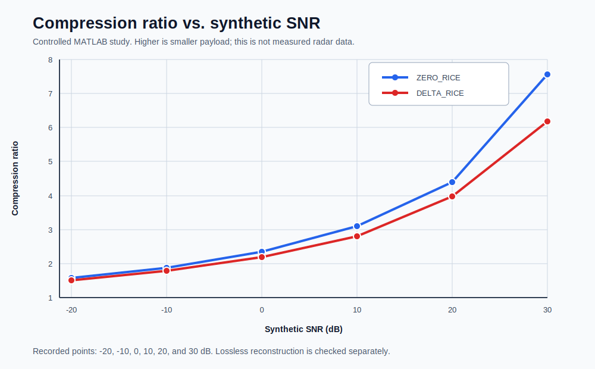

# Algorithm

[中文](../zh-CN/algorithm.md)

## Problem Definition

RDTC v1 operates on block-organized complex Range-Doppler samples. A public benchmark block contains `1024` I16Q16 samples, or `4096` raw bytes. The goal is to reduce packet payload without changing any sample value, while keeping every packet self-describing with its mode, length, sequence metadata, and decode parameters.

## Three Coding Paths

| Mode | Prediction and coding | Selection boundary |
|---|---|---|
| `RAW_BYPASS` | Packages original I/Q samples directly | May be configured per block; encoder variants with payload-cost fallback may also select it when Rice coding does not reduce payload size |
| `ZERO_RICE` | Predicts zero and codes I/Q separately | Suited to spectra with many near-zero values |
| `DELTA_RICE` | Predicts from the previous sample in the same channel | Exploits correlation between adjacent samples |

`ZERO_RICE` versus `DELTA_RICE` is supplied by each block descriptor or configuration. The internal policy selects only `k`; it does not switch automatically between predictor modes. The ZERO and DELTA paths compute signed residuals and map them to non-negative integers with a zig-zag-style transform. Prefix cost is evaluated over candidate `k` values for the block. After selection, the lane-parallel bitpacker emits a unary quotient, delimiter zero, and MSB-first remainder. The decoder follows the payload-bit count in the header; tail AXI padding is not decoded.

Encoder variants that implement RAW fallback compare payload cost. The packet still carries the `64`-byte header so framing, metadata, and error checks remain uniform. Not every published wrapper path enables this fallback; see [Architecture](architecture.md) for the exact boundary.

## MATLAB Synthetic Study

Algorithm selection uses controlled synthetic Range-Doppler-like data to study trends. This dataset is not a measured radar capture and does not establish a real-scene distribution or a final compression-ratio bound.

| Synthetic SNR (dB) | -20 | -10 | 0 | 10 | 20 | 30 |
|---|---:|---:|---:|---:|---:|---:|
| ZERO_RICE ratio | 1.5817 | 1.8774 | 2.3470 | 3.0979 | 4.3915 | 7.5588 |
| DELTA_RICE ratio | 1.4997 | 1.7871 | 2.1852 | 2.8083 | 3.9669 | 6.1779 |

For the recorded synthetic cases, ZERO_RICE and DELTA_RICE reconstruct with zero error, and the selected point-cloud comparison has a match ratio of 1. That point-cloud comparison is a MATLAB result check; it does not imply that PointCloud RTL is included.

Public evidence summary and data: [MATLAB evidence](../../evidence/rdtc_v1_matlab_algorithm_study.yaml) · [public CSV](../../evidence/data/rdtc_v1_matlab_lossless_snr.csv)

## From Model To Bitstream

The algorithm contract reaches RTL through these invariants:

- I/Q samples must reconstruct bit-exactly;
- `selected_k`, payload-bit count, and packet-byte count must match the reference model;
- `tkeep` and `tlast` must mark the final beat exactly;
- backpressure may pause transfer but must not change packet contents;
- malformed headers, illegal modes, and out-of-range lengths must be detected rather than silently decoded.

MATLAB supports vector generation and algorithm study. The C reference model is the authoritative executable entrypoint for the public bit-exact cross-check. A finite-vector PASS is not exhaustive formal proof; see [Verification](verification.md) and [Limitations](limitations.md) for the complete boundary.
