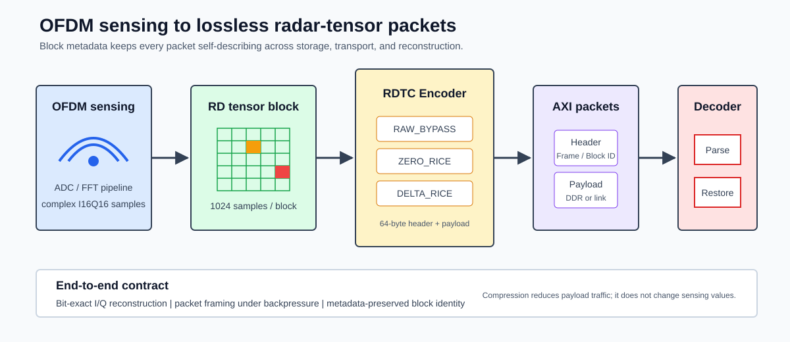
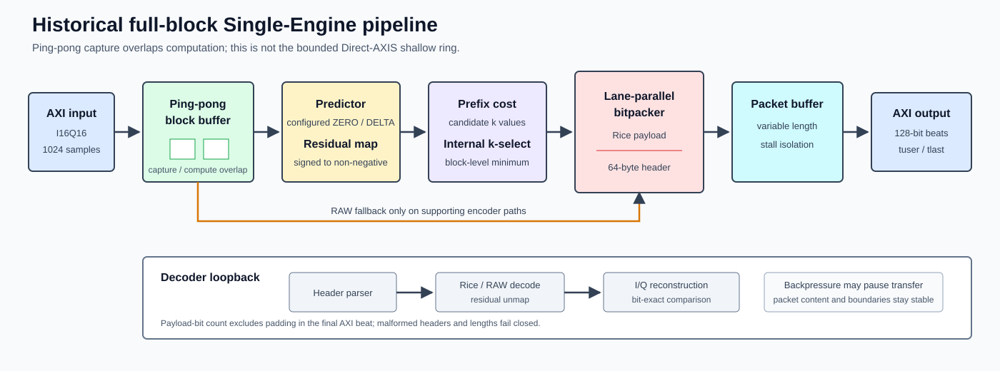
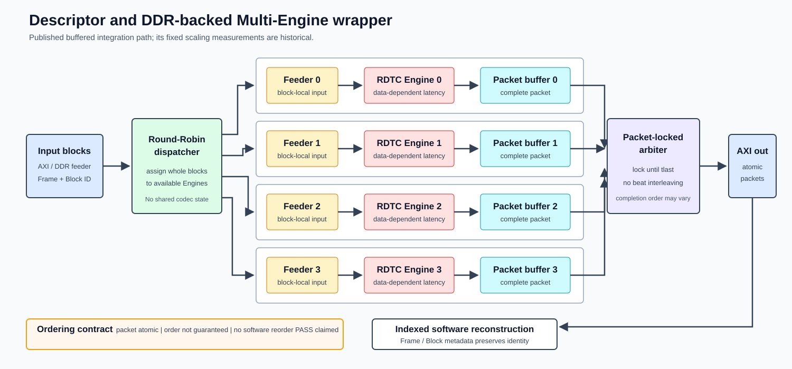
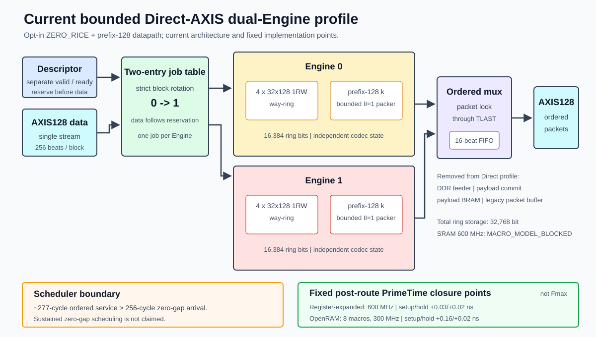

# Architecture

[中文](../zh-CN/architecture.md) · [Back to README](../../README.en.md)

## System Contract

RDTC sits between sensing-data generation and off-chip storage or transport. The Encoder converts consecutive Range-Doppler blocks into lossless packets with metadata, and the Decoder reconstructs the same I/Q samples at the consumer.

| Contract | Public reference configuration |
|---|---|
| Block | `1024` I16Q16 samples and `4096` raw bytes |
| Packet | 64-byte self-describing header + RAW/Rice payload |
| Stream | 128-bit AXI-Stream with exact `tkeep/tlast` and backpressure support |
| Identity | Frame, Block, and Range metadata preserve packet identity |
| Reconstruction | Decoder restores I/Q bit-exactly and fails closed on malformed streams |

See [Interfaces](interfaces.md) and [Bitstream Format](bitstream_format.md) for the external contract.

| Architecture layer | Published RTL |
|---|---|
| Complete control surface | [`mrtc_top`](../../rtl/top/mrtc_top.sv) plus [`mrtc_axi_lite_reg_block`](../../rtl/top/mrtc_axi_lite_reg_block.sv) |
| Single-Engine codec | [`mrtc_rdtc_codec_top`](../../rtl/rdtc/mrtc_rdtc_codec_top.sv) |
| DDR Multi-Engine | [`mrtc_rdtc_ddr_multiengine_wrapper`](../../rtl/rdtc/mrtc_rdtc_ddr_multiengine_wrapper.sv) |
| Bounded Direct-AXIS dual Engine (opt-in) | [`mrtc_rdtc_bounded_axis_multiengine_wrapper`](../../rtl/rdtc/mrtc_rdtc_bounded_axis_multiengine_wrapper.sv) |
| AXIS32 FPGA adaptation | [`mrtc_rdtc_axis32_wrapper`](../../rtl/rdtc/mrtc_rdtc_axis32_wrapper.sv) |

## Single-Engine Pipeline

A Single Engine progresses through these stages:

1. **Capture**: AXI input captures a complete block; ping-pong banks overlap reception of the next block with computation on the current block.
2. **Predict and map**: the block configuration selects ZERO or DELTA prediction, and I/Q residuals are independently mapped to non-negative values.
3. **Cost and select**: the prefix accumulator evaluates candidate `k` values, and the block policy selects `k`; only supporting encoder paths may fall back to RAW.
4. **Pack and frame**: the lane-parallel bitpacker emits the variable-length payload, while the header generator writes mode, length, and Frame/Block metadata.
5. **Decouple output**: the packet buffer isolates computation from AXI backpressure while preserving packet content and boundaries.
6. **Decode**: the header parser validates the format, and the Decoder reconstructs residuals and I/Q using the exact payload-bit count.

The DDR-backed `mrtc_rdtc_encoder_top` supports coding-cost-based RAW fallback. The small-buffer lane used by the AXIS32 wrapper has internal RAW fallback disabled. The architecture therefore presents RAW fallback as a path-dependent capability, not a universal wrapper guarantee.

## Descriptor/DDR Multi-Engine Wrapper

The Multi-Engine wrapper addresses system throughput when Single-Engine latency depends on block data:

- the round-robin dispatcher assigns complete blocks and never splits block-local state;
- every Engine has an independent feeder, codec state, and packet buffer;
- once the arbiter selects a packet, it holds the grant through that packet's `tlast`;
- beats from different packets do not interleave, while packet completion order may vary;
- header metadata preserves Frame/Block identity for indexed reconstruction at the consumer.

### Ordering Contract

| Property | Guarantee |
|---|---|
| Packet atomicity | verified: no beat interleaving within a packet |
| Input-order preservation | not guaranteed; data-dependent encoded length may change completion order |
| `OUTPUT_IN_ORDER=1` | not implemented; the public smoke requires this configuration to fail fast |
| Observed reorder event | the recorded workload did not directly observe one, so no triggered-reorder claim is made |
| Software reorder | metadata supports indexed reconstruction, but no software implementation PASS is claimed |

This choice avoids the buffering, control complexity, and head-of-line blocking of a hardware reorder buffer while leaving ordering policy explicit at the system-integration layer.

## Bounded Direct-AXIS Profile

The opt-in Direct profile targets a lower-storage path for a bounded signal domain. One AXIS128 source sends 256 beats per block. A two-entry job table assigns complete blocks strictly to Engine 0, then Engine 1, while output remains input-job ordered and packet-locked through `tlast`.

Each Engine contains four `32x128` true-1RW ways, a two-entry registered ingress queue, a prefix-128 estimator, and the fixed-rate bounded bitpacker. The estimator observes accepted input directly and does not consume the RAM read port. The wrapper removes the DDR feeder and per-Engine payload commit stores; a global 16-beat FIFO absorbs short output stalls. The two Engines therefore contain `32,768` bulk ring bits, versus the prior payload-backed experiment's `180,224` bulk bits.

This simplification is deliberately fail-stop:

- only `ZERO_RICE` with block-adaptive prefix `k` is accepted;
- every eight-sample Rice word must fit in `128` bits;
- one Engine issues all 256 ring reads at `II=1` after `k` becomes available;
- a same-way read/write collision, cadence failure, malformed block, or exhausted output credit raises sticky fatal status;
- without speculative payload storage, a fatal event can leave a partial packet externally visible, so producer and receiver state must be reset together.

The fixed regression observes about `277 cycles` of ordered packet service for a block arriving every `256 cycles`. That deficit accumulates and eventually creates a legal way conflict. The profile verifies bounded datapath behavior and implementation closure, but does not verify sustained zero-gap scheduling.

## Historical Buffered Throughput Scaling

The historical fixed-commit 256-block workload uses the Stage16D2 `785 cycles/block` single-Engine result as its same-workload reference. The 2/4-Engine buffered-wrapper runs achieve `397.52 / 197.41 cycles/block`, with efficiencies of `98.7368% / 99.4115%`. The 1-Engine reference was not rerun through the wrapper with `NUM_ENGINES=1`; one beam is defined as 256 blocks in this record.

At an assumed 200 MHz, unrounded total-cycle values in the CSV project `1965.3022 / 3957.4642 beam/s`. These are RTL simulation projections, not FPGA implemented timing, measured board DDR throughput, or network throughput. The current public adaptation runs only a 2-Engine, 2-block correctness smoke and does not recompute the historical performance matrix.

Sources: [Multi-Engine evidence](../../evidence/rdtc_v1_multiengine_rtl.yaml) · [public CSV](../../evidence/data/rdtc_v1_multiengine_scaling.csv)

## Memory-Implementation Boundary

The historical `register-expanded` and `sram-macro` profiles preserve the same external AXI, packet, and functional contract while changing the prefix/sample-buffer binding. The Direct profile applies the same principle specifically to its eight `32x128` way memories: either all eight are expanded into standard cells or all eight bind to 1RW OpenRAM macros. The 16-beat output queue and control state remain registers. A memory-binding change does not remove buffering behavior or change packet bytes.

[See ASIC implementation and profile maturity](asic_implementation.md)
