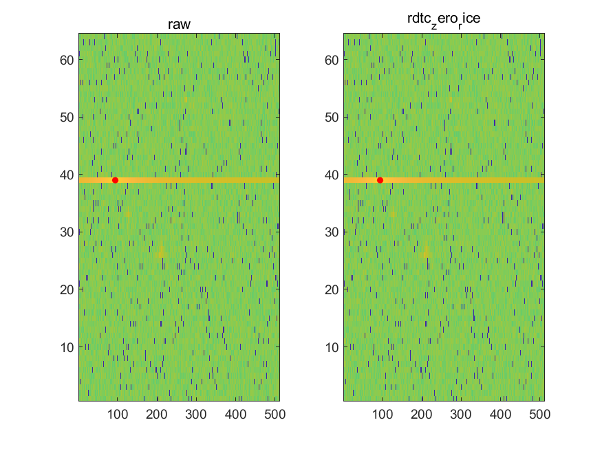

# 算法

[English](../en/algorithm.md) · [返回首页](../../README.md)

## 一分钟理解

RDTC v1 面向按 block 组织的 Range-Doppler 复数样本。公开基准 block 包含 `1024` 个 I16Q16 sample，即 `4096` byte 原始数据。Encoder 为每个 block 生成独立 packet，Decoder 仅依赖 64-byte header 与 payload 即可恢复完全相同的 I/Q 样本。

设计目标不是追求任意场景下的最高压缩率，而是在下面四项之间取得适合流式硬件的平衡：

| 目标 | RDTC v1 的选择 |
|---|---|
| 数据保真 | I/Q sample bit-exact reconstruction |
| 硬件结构 | predictor、加法/移位、prefix cost、规则化 Rice code |
| 流式传输 | self-describing packet、精确 payload bit count、`tkeep/tlast` |
| 最坏情况 | 显式 RAW 模式；部分 encoder path 支持无收益时的 RAW fallback |

## ZERO 与 DELTA 预测

对 I/Q 两个分量分别处理。令通道 $c \in \{I,Q\}$，当前样本为 $x_c[n]$，预测值为 $p_c[n]$：

$$
p_c[n] =
\begin{cases}
0, & \text{ZERO\_RICE} \\
0, & \text{DELTA\_RICE and } n=0 \\
x_c[n-1], & \text{DELTA\_RICE and } n>0
\end{cases}
$$

残差为：

$$r_c[n] = x_c[n] - p_c[n]$$

因此 DELTA_RICE 的第一个 I 和 Q sample 都以 0 为预测值，之后各自使用同一分量的前一样本；I 与 Q 的 predictor state 不混用。

## Signed Mapping 与 Rice Code

有符号残差通过可逆映射转换为非负整数：

$$
m(r) =
\begin{cases}
2r, & r \ge 0 \\
-2r-1, & r < 0
\end{cases}
$$

给定 Rice 参数 $k$，mapped value 被拆成 quotient 与 remainder：

$$q = m \gg k, \qquad s = m \mathbin{\&} (2^k-1)$$

码字由 $q$ 个 `1`、一个终止 `0` 和 $k$ bit MSB-first remainder 组成，所以单个 mapped value 的码长为：

$$L_k(m) = q + 1 + k$$

block-adaptive 模式对公开实现支持的 $k \in [0,15]$ 统计 I/Q 全部 mapped value 的总代价，并选择：

$$k^* = \operatorname*{arg\,min}_{0 \le k \le 15} \sum_{n,c} L_k(m(r_c[n]))$$

相同总代价时保留先扫描到的较小 $k$。Decoder 从 header 取得 `rice_k` 和精确 payload bit count，AXI 最后一个 beat 的 padding 不参与解码。

## 三种编码路径

| 模式 | 数据路径 | 使用边界 |
|---|---|---|
| `RAW_BYPASS` | 直接封装 sample-major I16Q16 | 可由 block 配置；也是部分 encoder path 的 fallback 结果 |
| `ZERO_RICE` | 预测值恒为 0，再做 signed mapping 与 Rice coding | 适合大量小幅值或接近零的谱 |
| `DELTA_RICE` | 每个 I/Q 分量分别使用前一样本预测 | 利用同一通道相邻 sample 的相关性 |

ZERO_RICE 与 DELTA_RICE 由 block descriptor 或 configuration 指定；内部 policy 选择的是 `k`，不在两个 predictor mode 之间自动切换。RAW fallback 也不是所有 wrapper 的共同能力：DDR-backed encoder path 支持基于编码代价的 fallback，而公开 AXIS32 small-buffer lane 未启用内部 RAW fallback。任何集成 claim 都必须指出实际验证的 encoder path。

## MATLAB Synthetic Study

算法研究使用受控 synthetic Range-Doppler-beam scene，而不是实测 radar capture。公开曲线只保留固定 SNR 点，不插值或推导未执行场景。

| Synthetic SNR (dB) | -20 | -10 | 0 | 10 | 20 | 30 |
|---|---:|---:|---:|---:|---:|---:|
| ZERO_RICE ratio | 1.5817 | 1.8774 | 2.3470 | 3.0979 | 4.3915 | 7.5588 |
| DELTA_RICE ratio | 1.4997 | 1.7871 | 2.1852 | 2.8083 | 3.9669 | 6.1779 |

记录的 12 个 ZERO/DELTA case 均满足 `NMSE=0`、`max_abs_error=0` 和 point-cloud match ratio `1`。这里的 point-cloud comparison 是 MATLAB 对重建谱的分析，不表示仓库包含 PointCloud RTL。

下面是固定 source commit 中未经裁剪或重绘的 MATLAB 原始输出。左右两幅图分别为 raw 与 ZERO_RICE 解码后的 Range-Doppler 表示；它用于展示记录场景的重建一致性，不建立现实雷达数据分布或压缩率上界。

来源：[MATLAB evidence](../../evidence/rdtc_v1_matlab_algorithm_study.yaml) · [公开 CSV](../../evidence/data/rdtc_v1_matlab_lossless_snr.csv)

## 从模型到码流

算法合同由以下不变量连接到 C model 与 RTL：

- I/Q 样本必须 bit-exact 恢复；
- `selected_k`、payload bit count 和 packet byte count 必须与 reference model 一致；
- `tkeep` 与 `tlast` 必须精确标记最后一个 beat；
- backpressure 只能暂停传输，不能改变 packet 内容；
- malformed header、非法 mode 或越界长度必须被检测，而不是静默解码。

MATLAB 用于算法观察和向量生成；公开可执行的权威 bit-exact 入口是 `make -C ref_model/c test` 及对应 DPI-C/RTL regression。有限向量 PASS 不等于形式穷尽证明，完整边界见[验证](verification.md)与[限制](limitations.md)。
