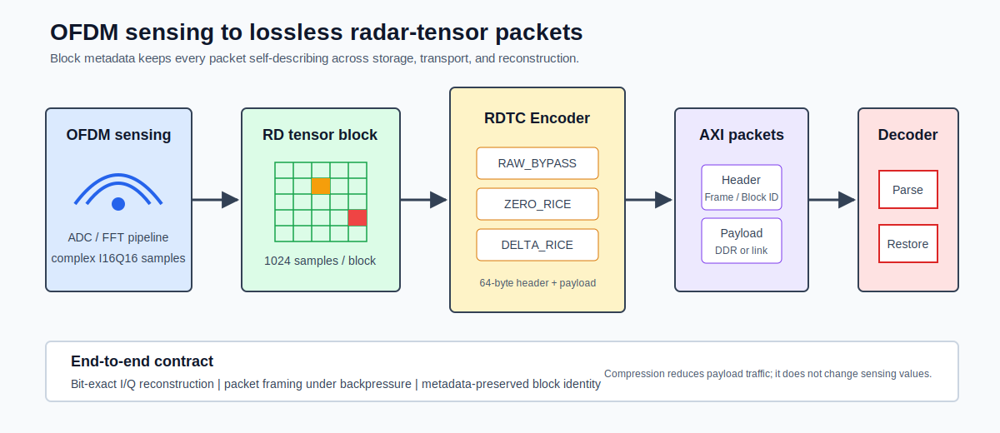
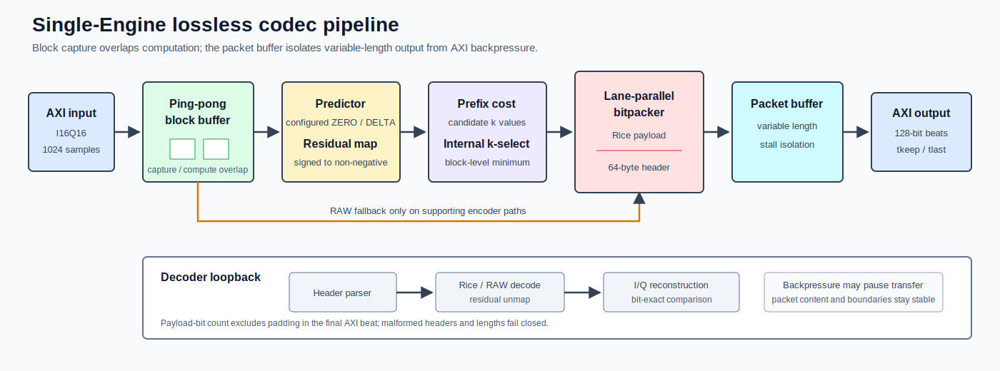
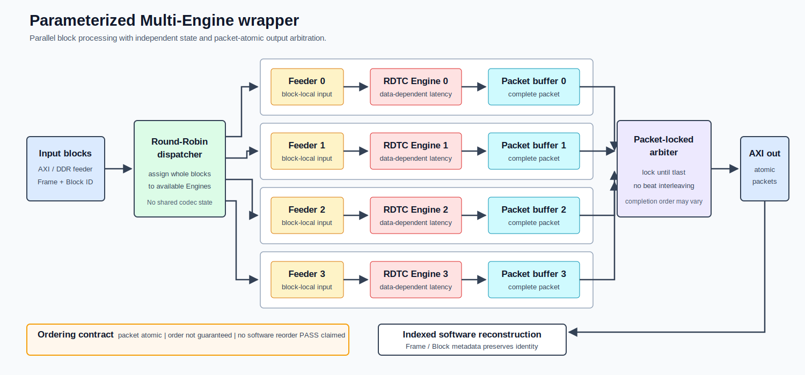
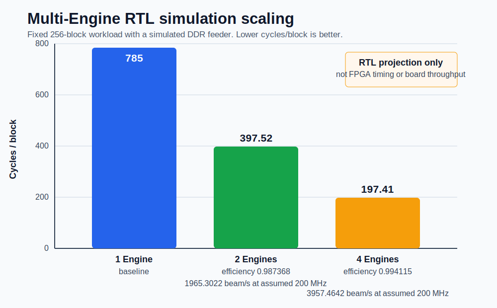

# 架构

[English](../en/architecture.md)

## 系统位置

RDTC 位于感知数据生成与片外存储/传输之间。Encoder 把连续 Range-Doppler block 转换为带 metadata 的无损 packet；Decoder 在消费端恢复相同 I/Q 样本。接口与 packet 格式分别见[接口](interfaces.md)和[码流格式](bitstream_format.md)。

## 单 Engine 数据路径

单 Engine 由以下阶段组成：

1. AXI 输入捕获完整 block，并通过 ping-pong buffer 将下一 block 的接收与当前 block 的计算重叠；
2. 每个 block 配置的 predictor mode 生成 ZERO 或 DELTA residual，signed mapper 转换为非负值；
3. Prefix accumulator 对 candidate `k` 计算成本，内部 block policy 选择 `k`；支持 payload-cost fallback 的 encoder path 可在 Rice payload 无收益时选择 RAW；
4. Lane-parallel bitpacker 生成变长 payload，header generator 写入模式、长度和 Frame/Block metadata；
5. Packet buffer 将计算侧与 AXI 输出 backpressure 解耦；启用 RAW fallback 的路径复用相同 packet contract；
6. Decoder 解析 header、执行格式检查、恢复 residual 和 I/Q sample，并检查 packet 边界。

公开基准 block 是 `1024` 个 I16Q16 sample，原始大小 `4096` byte；packet 使用 `64`-byte header 和 128-bit AXI-Stream 数据通路。

`ZERO_RICE` 与 `DELTA_RICE` 由 block descriptor 或 configuration 提供，内部 `k` policy 不在这两个 predictor mode 之间做选择。DDR-backed `mrtc_rdtc_encoder_top` 支持基于 payload cost 的 RAW fallback；AXIS32 wrapper 使用的 AXIS2Eng small-buffer lane 未启用内部 RAW fallback。因此任何集成 claim 都必须说明实际验证的是哪一条 encoder path。

## Multi-Engine Wrapper

参数化 wrapper 解决的是单 Engine 数据相关延迟和输入带宽之间的系统吞吐问题：

- Round-Robin dispatcher 按 block 把输入工作分配给可用 Engine；
- 每个 Engine 有独立 feeder、codec 和 packet buffer，避免共享中间状态；
- arbiter 一旦选择某个 packet，就锁定到该 packet 的 `tlast`，因此不同 packet 的 beat 不会交织；
- 完成顺序取决于 block 数据与压缩长度，输出顺序不保证；
- header 中的 Frame/Block metadata 保留身份，使软件能够按索引重建原始序列。

每个 descriptor 将配置的 codec mode 送入分配到的 Engine。Engine 内部执行 `k` selection；只有实现 payload-cost fallback 的 encoder variant 才具备 RAW fallback。

该架构选择 packet-level atomic output 与有限乱序，而不是硬件 Reorder Buffer，从而避免严格保序的缓存开销、复杂控制与队首阻塞。当前 `OUTPUT_IN_ORDER` 不是已实现模式；任何集成都不应把该参数解释为硬件保序保证。

现有 regression 验证 packet 内容、边界和身份，但记录场景没有直接证明一次实际乱序事件，且不包含已验证的软件 reorder 程序。因此准确表述是“metadata enables indexed software reconstruction”，而不是“软件重排已通过”。

## 吞吐扩展

历史 fixed-commit 256-block workload 的 `1/2/4` Engine 结果为 `785 / 397.52 / 197.41 cycles/block`。该 workload 把一个 beam 定义为 256 个 block；2/4 Engine efficiency 为 `0.987368 / 0.994115`，假设 200 MHz 时由未舍入总周期投影吞吐为 `1965.3022 / 3957.4642 beam/s`。

这些结果来自 RTL simulation 与 simulated DDR feeder，不是 FPGA implemented timing、板级 DDR 测量或网络吞吐结果。当前公开 adaptation 只提供 2-Engine、2-block correctness smoke，不重算历史性能矩阵。

## 存储实现边界

`register-expanded` 与 `sram-macro` profile 保持相同的外部 AXI、packet 和功能合同，只改变 prefix/sample buffer 的物理 binding。同步 SRAM 的一拍读延迟由 wrapper 适配；存储实现差异不得被解释为删除 buffer 功能或改变码流。详见 [ASIC 实现](asic_implementation.md)。
