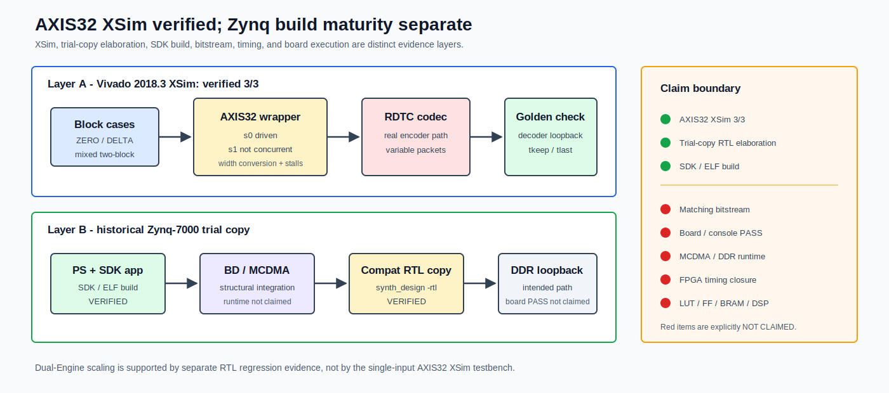

# FPGA Emulation 与 Zynq 集成

[English](../en/fpga_implementation.md)

## 结论

**FPGA emulation verified.** 该表述专指 Vivado 2018.3 AXIS32 wrapper 的 XSim 功能结果：记录的 `3/3` cases 通过。另一个独立成熟度结果是，历史 Zynq-7000 trial copy 使用 compatibility-copied RTL 完成 elaboration，并完成 SDK/ELF build。当前公开 RTL 不声明可直接在 Vivado 2018.3 elaboration；也不声明 bitstream、板上运行或 timing closure。

## AXIS32 Wrapper XSim

Vivado 2018.3 XSim 的 `3/3` block-level cases 通过：

- ZERO_RICE block；
- DELTA_RICE block，并覆盖输出 backpressure；
- mixed two-block sequence，并检查 packet boundary。

Testbench 经过真实 RDTC encoder path，并用 decoder golden comparison 检查恢复数据。覆盖范围包括 AXIS32 width conversion、可变长 packet serialization、最后 beat 的 `tkeep/tlast`、输入 gap 和输出 stall。

该 testbench 只驱动 `s0`，`s1` 未作为并发输入使用。因此这里不声称 XSim 已验证双 Engine scaling、双输入并发或乱序输出。Multi-Engine scaling 和 packet arbitration 由独立 RTL regression 支撑。

## Zynq-7000 平台路径

早期 Vivado/SDK trial copy 包含 Zynq PS、Block Design、MCDMA/DDR 连接与软件测试程序，可用于构建 SoC 回环验证路径。Vivado 2018.3 不接受仓库中的 `parameter string`，因此记录的成功 `synth_design -rtl` 使用经过兼容处理的 copied RTL。当前公开且受 evidence 边界约束的结论限定为：

| 层次 | 状态 | 可以说明什么 |
|---|---|---|
| 当前公开 RTL source and wrapper | verified input | 可进入现代 SystemVerilog 仿真；不等于 Vivado 2018.3 直接 elaboration |
| Trial-copy RTL elaboration | verified with compatibility copy | 历史 trial copy 的结构、端口和依赖完成 `synth_design -rtl` |
| SDK/ELF build | verified | 平台软件工程能够构建 |
| Matching bitstream | not claimed | 未声明当前双 Engine wrapper 生成匹配 bitstream |
| Board execution / console PASS | not claimed | 未声明板上 workload 或 console marker PASS |
| MCDMA/DDR/cache runtime | not claimed | 未声明 DMA descriptor、cache coherency 或实测 DDR 行为 |
| FPGA timing/resources | not claimed | 未发布器件绑定的 WNS、Fmax、LUT/FF/BRAM/DSP 结果 |

因此推荐的完整表述是：

> FPGA emulation 结果：AXIS32 datapath XSim suite `3/3` verified。独立的 Zynq trial-copy 成熟度结果：compatibility-copied RTL elaboration 与 SDK/ELF build verified；当前公开 RTL 的直接 elaboration 和板上硬件执行均未声明。

历史平台包含 BD/MCDMA 结构与软件接口，但这里的 verified 层次只到 trial-copy elaboration 和 SDK/ELF build，不等于当前公开 RTL 的直接 Vivado 2018.3 elaboration，也不等于 MCDMA runtime PASS。

公开 evidence 摘要与数据：[XSim evidence](../../evidence/rdtc_v1_fpga_axis32_emulation.yaml) · [Zynq trial-build evidence](../../evidence/rdtc_v1_zynq_trial_build.yaml) · [XSim case CSV](../../evidence/data/rdtc_v1_fpga_axis32_xsim_cases.csv)

## 与 Multi-Engine 结果的关系

FPGA 页面与 Multi-Engine RTL evidence 解决不同问题：

- FPGA XSim 证明 AXIS32 adapter、真实 codec path 和 loopback checker 在记录的三组 case 中工作；
- Multi-Engine RTL regression 证明 block distribution、独立 packet buffer、packet-locked output 和扩展性；
- 两者不能合并成“双 Engine bitstream 板级验证通过”的 claim。

假设 200 MHz 的 `1965.3022 / 3957.4642 beam/s` 只是 2/4 Engine RTL simulation projection；一个 beam 在该记录中是 256 个 block，吞吐由未舍入总周期计算，不是 FPGA implementation frequency。任何未来板级结果必须绑定器件、Vivado version、constraints、bitstream hash、software hash、测试向量和 console/result marker。
