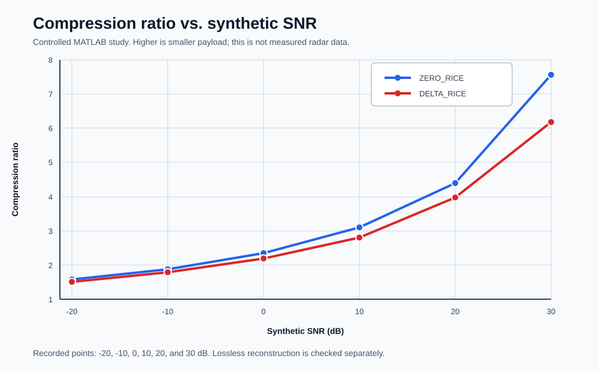
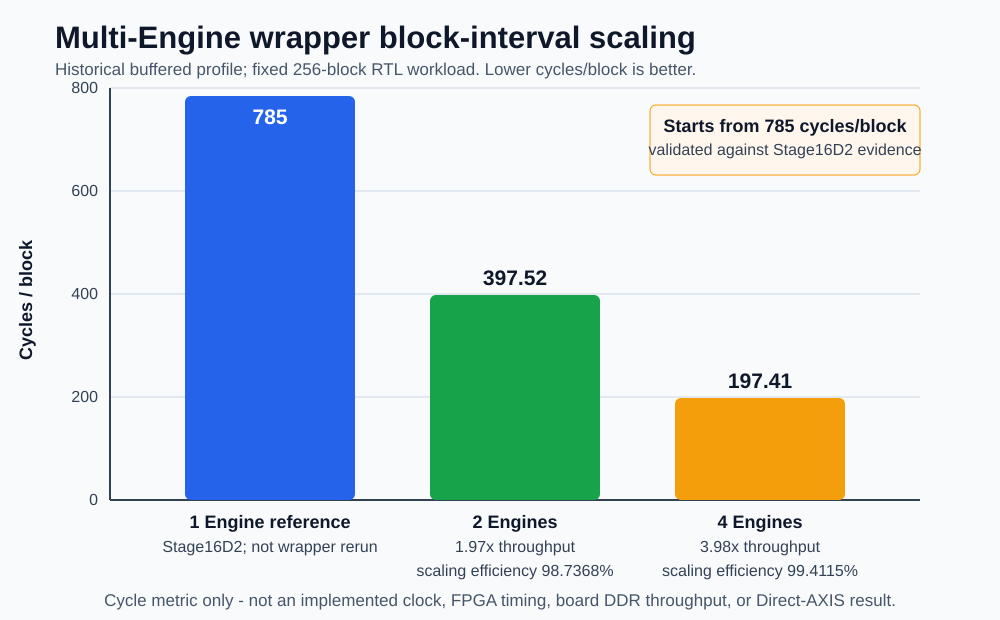

# 已核验结果

[English](../en/results.md)

[性能演进](#performance-evolution) · [实现闭合](#implementation-closure) · [Stage 1 架构功耗](asic_power_experiment.md) · [Stage 2 时钟门控](asic_clock_gating_experiment.md)

## 算法与功能验证

| Result | Profile | Status | Caveat |
|---|---|---|---|
| MATLAB synthetic ZERO/DELTA lossless reconstruction | 受控 synthetic study | verified for recorded cases | 不是实测 radar dataset；不表示 PointCloud RTL。 |
| MATLAB/C/DPI-C/RTL legal-vector bit-exact agreement | RDTC v1 public release | verified | 有限向量与 regression 集，不是形式穷尽证明。 |
| Dual-AXIS128 wrapper VCS regression, 10 required cases | RDTC v1 public release | verified | 有限 wrapper regression，不是 coverage closure。 |
| Bounded Direct-AXIS 两 block packet、selected-k 与 decoder 等价 | Direct 双 Engine register profile | verified | 有限 bounded-domain regression；持续零间隔调度受限于 `277 > 256 cycles/block`。 |

Direct 功能来源：[bounded Direct RTL evidence](../../evidence/rdtc_v1_bounded_direct_rtl.yaml)

Synthetic SNR 从 `-20` 到 `30 dB` 时，ZERO_RICE compression ratio 为 `1.5817 / 1.8774 / 2.3470 / 3.0979 / 4.3915 / 7.5588`，DELTA_RICE 为 `1.4997 / 1.7871 / 2.1852 / 2.8083 / 3.9669 / 6.1779`。完整解释见[算法](algorithm.md)。

来源：[MATLAB evidence](../../evidence/rdtc_v1_matlab_algorithm_study.yaml) · [公开 CSV](../../evidence/data/rdtc_v1_matlab_lossless_snr.csv)

## Bitpacker Pipeline A/B

历史 Stage16C3 与 Stage16D2 使用相同的 `smoke_zero_sparse` 输入、相同 latency monitor、相同 `selected_k=0` 和相同 `2158-bit / 270-byte` payload。把逐 sample compressed path 替换为集成四路 word Bitpacker 后，从首个 payload valid 到 accepted packet `TLAST` 的 inclusive interval 从 `7693` 降至 `721 cycles`，减少 `90.63%`，提升 `10.67×`。两点 input/output stall 均为0，334-byte packet逐字节一致，decoder loopback通过。

在另一组固定 256-block ZERO_RICE stream 中，单 Engine 平均 packet-completion spacing 从 `8220` 降至 `785 cycles/block`，减少 `90.45%`，提升 `10.47×`。上文 `721` 来自独立 `smoke_zero_sparse` 的首个 payload valid 到 accepted `TLAST` 测量；`785` 则是 256-block stream 的 packet-to-packet 平均块间隔。两版都已启用 prefix-during-capture；该 A/B 的差值主要隔离集成 Lane4 Bitpacker，不能把全部提升归因于前端乒乓。

`785 cycles/block` 是 steady-state service interval，不是单 block latency；两项指标也都不是当前 Direct-AXIS 持续吞吐、FPGA性能、ASIC频率或Fmax。

来源：[Bitpacker A/B evidence](../../evidence/rdtc_v1_bitpacker_pipeline_ab.yaml) · [公开两点 CSV](../../evidence/data/rdtc_v1_bitpacker_pipeline_ab.csv)

## Multi-Engine RTL Scaling

历史 fixed-commit 256-block prefix workload 以同 workload 的 Stage16D2 单 Engine 结果为 reference，再通过 simulated DDR feeder 测量 2/4-Engine buffered wrapper，并检查 payload byte-exact、`selected_k`、compression ratio、packet 完整性和无 beat interleaving。该记录把一个 beam 定义为 256 个 block；`beam/s` 由公开 CSV 中未舍入的 `estimated_cycles_per_beam` 计算，不能仅由表中两位小数的 cycles/block 精确反推。

| Engines | Cycles/block | Scaling efficiency | Beam/s at assumed 200 MHz |
|---:|---:|---:|---:|
| 1（Stage16D2 reference） | 785 | baseline | - |
| 2 | 397.52 | 98.7368% | 1965.3022 |
| 4 | 197.41 | 99.4115% | 3957.4642 |

这些是 RTL simulation projection，不是 FPGA timing closure、implemented clock 或板级 DDR 吞吐。`785` 行是导入的同 workload Stage16D2 reference，不是 wrapper `NUM_ENGINES=1` 重跑。当前公开 adaptation 另有 2-Engine、2-block correctness smoke，但不重算该性能矩阵。输出 packet 保持 atomic，不同 packet 的 beat 不交织；完成顺序不保证。Frame/Block metadata 支持软件 indexed reconstruction，但没有软件 reorder PASS claim，记录场景也没有直接证明一次实际乱序事件。

来源：[Multi-Engine evidence](../../evidence/rdtc_v1_multiengine_rtl.yaml) · [公开 CSV](../../evidence/data/rdtc_v1_multiengine_scaling.csv)

## FPGA Emulation

| Scope | Result | Status | Boundary |
|---|---|---|---|
| 固定 commit 的 Vivado 2018.3 AXIS32 wrapper XSim | ZERO_RICE、DELTA_RICE、mixed two-block，`3/3` PASS | FPGA emulation verified | 当前公开 adaptation 另有 Icarus smoke；XSim 只驱动 `s0`，不作为双 Engine scaling 证据 |
| Bounded Direct-AXIS Vivado 2022.2 OOC post-route | `xc7z100ffg900-2`、200 MHz、setup/hold WNS `+0.001/+0.062 ns`、`32,672 LUT / 18,519 FF / 0 BRAM` | fixed internal timing/resource point verified | 不声明 board IO timing、Fmax、bitstream、board 或持续零停顿 |
| 历史 Zynq-7000 trial copy | compatibility-copied RTL elaboration 与 SDK/ELF build | verified at trial-build layer | 当前公开 RTL 不声明直接 Vivado 2018.3 elaboration；不声明 matching bitstream 或 board execution |
| Bitstream/board/MCDMA runtime | 未提供匹配结果 | not claimed | 不从 simulation、OOC implementation 或 build 状态推导 |

FPGA XSim 覆盖真实 encoder path、decoder golden comparison、width conversion、可变长 packet、`tkeep/tlast`、输入 gap 和输出 backpressure。双 Engine 分发与仲裁来自独立 RTL regression，不与该单输入 XSim scope 合并。

来源：[XSim evidence](../../evidence/rdtc_v1_fpga_axis32_emulation.yaml) · [Direct OOC evidence](../../evidence/rdtc_v1_bounded_direct_fpga_ooc200.yaml) · [Zynq trial-build evidence](../../evidence/rdtc_v1_zynq_trial_build.yaml) · [XSim case CSV](../../evidence/data/rdtc_v1_fpga_axis32_xsim_cases.csv)

## 实现 Profile 矩阵

历史结果使用 `mrtc_rdtc_wb_wrapper` 的内部单时钟 reg-to-reg 约束；Direct 结果使用 `mrtc_rdtc_bounded_axis_multiengine_wrapper`，两者均未设置完整 top-level IO timing。`DC-only`/`DC matrix` 是综合估计；历史 550/333 MHz 与 Direct 600/300 MHz 则是完成布局布线后，PrimeTime 使用 matching routed netlist、SDC 与 same-run OpenRCX SPEF 得到的 setup/hold STA 闭合结果，不能与 DC 结果混称。

两个历史 Nangate45 physical profile 的 floorplan configuration 相同：die 为 `1200 x 1200 um`（`1.4400 mm2`），core 为 `1159.72 x 1155.20 um`（`1.3397 mm2`）；Direct profile 使用独立的 area/macro-derived floorplan。Configured geometry 不是未发布 GDS 的事后测量，standard-cell area 也不是 core 或 die area。

| Memory profile | Technology | Scope | Result | Status |
|---|---|---|---|---|
| `bounded-buffered-vs-direct` | Nangate45 TT/1.1 V/25 C | 同库同 315 MHz、全寄存器 DC A/B | Buffered `1,529,495.20 um2 / 786,342 cells`；Direct `420,208.44 um2 / 220,298 cells`；分别减少 `72.53% / 71.98%` | verified `PASS_DC_ONLY`；不是 SRAM 或 post-route 面积 |
| `register-expanded` | NanGate15 TT/0.8 V/25 C | DC-only | 400/600/800 MHz 均闭合；800 MHz WNS +0.22945 ns，cell area 99,064.13 um2 | verified |
| `register-expanded` | Nangate45 TT/1.1 V/25 C | DC matrix | 400/600/700 MHz 闭合；700 MHz WNS/TNS 0.00/0.00 ns；800 MHz WNS/TNS -0.14/-858.86 ns | verified |
| `register-expanded` | Nangate45/OpenROAD/OpenRCX | P&R + PT at 400 MHz | route DRC 0，antenna net/pin 0/0，area 418,007 um2，utilization 31.2108%；PT setup/hold WNS +0.80/+0.04 ns，constraint violation 0 | verified |
| `register-expanded` | Nangate45/OpenROAD/OpenRCX | fixed verified P&R + PT closure point at 550 MHz | 使用 700 MHz DC mapped netlist；configured die/core `1200 x 1200 um` / `1159.72 x 1155.20 um`；route DRC 0，antenna net/pin 0/0，area 421,120 um2，utilization 31.4432%；PT setup/hold WNS +0.26/+0.04 ns，constraint violation 0 | verified |
| `sram-macro` | Nangate45/OpenRAM/OpenROAD/OpenRCX | 双 `64x128 1RW1R` 宏；fixed verified 333 MHz P&R、同次 SPEF 与 PT 内部时序 closure point | configured die/core `1200 x 1200 um` / `1159.72 x 1155.20 um`；route DRC 为 0，antenna net/pin 为 0/0；PT setup/hold WNS +0.57/+0.04 ns，constraint violation 0 | 芯片级实现与内部时序 verified；属于 academic Nangate45/OpenRAM 平台，不声明 production PDK、macro signoff 或 silicon readiness |
| `bounded-direct-register-expanded` | Nangate45/OpenROAD/OpenRCX | fixed verified 600 MHz P&R + same-run SPEF + internal PT point；0 memory macro | route DRC 与 antenna net/pin 0/0；area 476,320 um2；PT setup/hold WNS +0.03/+0.02 ns；setup/hold coverage 50972/50972 | 内部实现/时序 verified；不是 Fmax 或持续零停顿 |
| `bounded-direct-sram-macro` | Nangate45/OpenRAM/OpenROAD/OpenRCX | 8 个 `32x128 1RW` 宏；fixed verified 300 MHz P&R + same-run SPEF + internal PT point | route DRC 与 antenna net/pin 0/0；PT setup/hold WNS +0.16/+0.02 ns；setup/hold coverage 18276/18276；300 MHz 宏 period/pulse 检查 clean | 顶层实现/时序 verified；macro DRC/LVS/PEX 未闭合；600 MHz 为 `MACRO_MODEL_BLOCKED` |

NanGate15 Liberty 使用 `1ps` 时间单位，DC profile 显式应用 `SDC_TIME_SCALE=1000.0`。最新 45 nm register-expanded 后端使用已闭合的 700 MHz DC netlist，在 550 MHz 进行物理实现；handoff netlist、SDC 与 SPEF 的 SHA256 在 evidence 中一致记录。PrimeTime setup/hold coverage 为 100%；1756 个未约束 max-delay endpoint 属于 internal-only profile 下的异步 reset pin。

SRAM-macro 的 333 MHz 结果已完成并验证芯片级 OpenROAD P&R、OpenRCX 同次 SPEF 及 PrimeTime 内部 setup/hold 时序；route DRC 和 antenna net/pin 均为 0，setup/hold WNS 为 +0.57/+0.04 ns。该结果作为 academic Nangate45/OpenRAM 平台上的 chip-level implementation evidence 展示：OpenRAM 时序模型为 analytical characterization，且本项目不提供 production PDK、macro DRC/LVS/PEX 或 silicon signoff。两个宏上共 256 个未使用 `dout0[127:0]` minimum-capacitance endpoint 采用精确审核 waiver；该 waiver 必须披露，但不影响已验证的 setup/hold 结果。它是 profile-specific、exact-set matched，不允许 missing 或 extra object，不是 blanket capacitance、setup/hold waiver，也不适用于功能性 read data。333 MHz 是当前 macro profile 的固定 verified closure point，不得扩大为 400 MHz claim。

## 结果解释

- `verified closure point` 只说明该明确配置与频率完成记录的 checks，不等于 maximum frequency；
- `DC timing estimate` 只说明给定 Liberty、ideal clock 和 synthesis constraint 下的内部时序；
- `internal reg-to-reg post-route timing` 使用 routed netlist、matching SDC 和 same-run SPEF，但不覆盖未建模的系统 IO；
- route-tool DRC 0 与 foundry DRC/LVS/PEX 是不同 scope；
- `top-level IO timing closure`、`OCV/MMMC` 与 `foundry signoff` 均未声明。

ASIC evidence：[buffered versus Direct DC A/B](../../evidence/rdtc_v1_bounded_buffered_vs_direct_dc_ab.yaml) · [register-expanded](../../evidence/rdtc_v1_register_expanded.yaml) · [SRAM macro](../../evidence/rdtc_v1_sram_macro_333m.yaml) · [bounded Direct register/SRAM](../../evidence/rdtc_v1_bounded_direct_asic.yaml)

## 两阶段 mapped 功耗研究

| 阶段 | 受控 A/B | BURST_IDLE dynamic | BURST_IDLE energy/block | ACTIVE_LEGAL dynamic | 边界 |
|---|---|---:|---:|---:|---|
| Stage 1 | Buffered -> Direct-AXIS | `436.4352 -> 109.8717 mW`（-74.83%） | `674.82 -> 167.59 nJ`（-75.17%） | -74.99% | 架构变化；RTL-SAIF-to-mapped |
| Stage 2 | Direct G0 -> Direct G1 | `107.3535 -> 41.1522 mW`（-61.67%） | `164.55 -> 68.36 nJ`（-58.46%） | -59.52% | 自动时钟门控；mapped zero-delay GLS activity |

两项是 baseline 不同的独立受控实验，百分比不得相加。Stage 2 插入 272 个
`CLKGATETST_X1`，门控 34,816 bit，覆盖全部 32,768 Ring data bit；setup、
clock-gating setup/hold slack 均非负，electrical violation 为 0。功能证据是
2/32/64-block gate-level regression equivalence evidence；没有运行 Formality。

[Stage-1 方法](asic_power_experiment.md) · [Stage-2 方法](asic_clock_gating_experiment.md) · [Stage-2 机器证据](../../evidence/rdtc_v1_clock_gating_mapped_dc/README.md)

公开 evidence 位于 `evidence/`，运行条件和边界位于 `provenance/`。PDK、Liberty/DB、LEF/GDS、SPEF 和原始 EDA 工作目录不随仓库发布。
