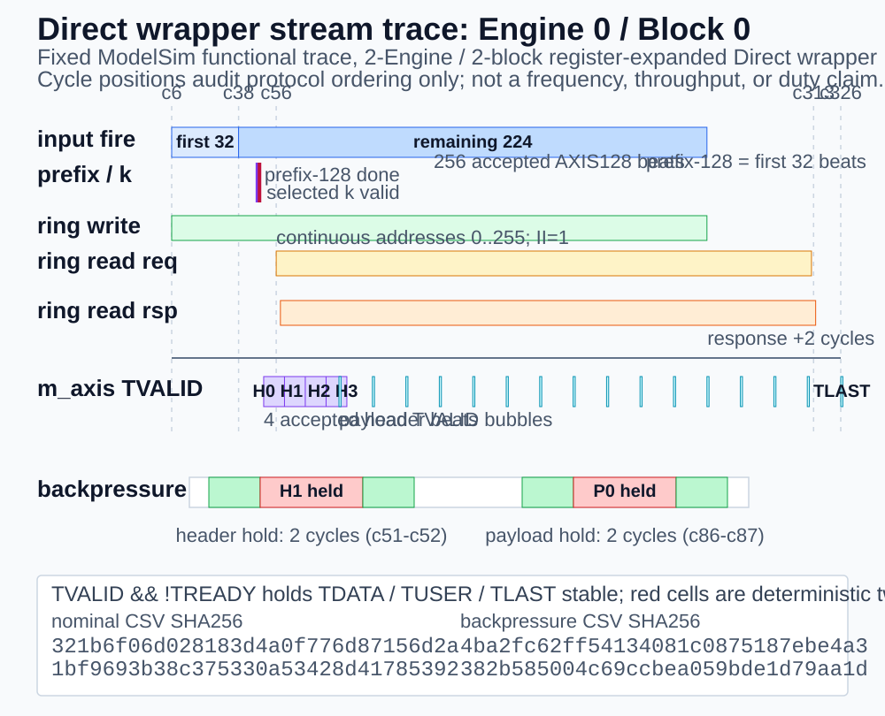
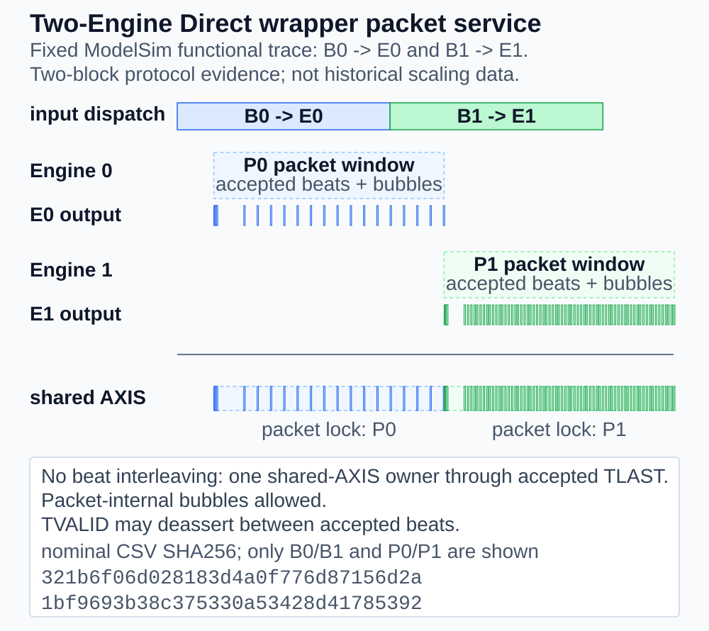

# 流时序与 Packet 服务

[English](../en/stream_timing.md) · [返回首页](../../README.md)

本页面向 IP 集成和数字 IC 代码审阅，区分 AXIS 协议合同、固定回归观测和历史吞吐结果。它不新增 RTL 功能，也不把一次功能 trace 写成通用延迟保证。

<a id="protocol-timing-contract"></a>

## Protocol Timing 合同

当前 bounded Direct-AXIS profile 是一个固定双 Engine wrapper：单路输入每个 block 为 `256` 个完整 AXIS128 beat，descriptor 按 Engine `0 -> 1` 轮转，输出 packet 按 job 顺序选择并锁定到 `TLAST`。输入 producer 必须先完成 descriptor 预约，只在 wrapper 报告的合法 ready 窗口发送数据。



上图由已发布 nominal/backpressure CSV 确定性生成，显示固定 ModelSim 功能回归中的真实事件顺序；绝对 cycle 仅用于复核关系，不是 frequency、duty 或 throughput claim。协议关系可先按下面的等宽图阅读；它是 protocol schematic，不是测量波形，横向间距不代表 cycle 数：

```text
input fire   [beat 0 ... beat 31 ........ beat 255/TLAST]
prefix       < 32 beats = 128 samples > -> selected k
ring write   [accepted source words; read-cleared slot can be reused]
ring read                         [req 0, 1, ... 255]  II=1
response                            [rsp 0, 1, ... 255]  +2 clocks
output       [H0 H1 H2 H3] ... [payload + legal bubbles] -> TLAST
stall        TVALID=1, TREADY=0 -> hold TDATA/TUSER/TLAST
```

<a id="ii1-vs-output-tvalid"></a>

`II=1` 只描述 ring/Bitpacker 每周期接收一个 128-bit source word 的 request cadence，不表示 `m_axis_comp_tvalid` 每周期都为 `1`。Rice token 累积和输出 word 对齐会产生合法 payload bubble；fail-stop halt 是普通 AXIS 保持语义的显式例外。

<a id="direct-engine0-trace"></a>

## Direct Engine 0 / Block 0 Trace

公开 [Evidence](../../evidence/rdtc_v1_direct_stream_timing_trace.yaml) 绑定固定 `99dbd4b`、ModelSim 2020.4、testbench/filelist/runner 身份，以及 [nominal CSV](../../evidence/data/rdtc_v1_direct_stream_timing_nominal.csv) 和 [backpressure CSV](../../evidence/data/rdtc_v1_direct_stream_timing_backpressure.csv)。两份 curated trace 均覆盖 cycle `6..603`，每份 `598` 行；完整 simulator log 和本机路径不公开，只记录 SHA256。

观测对象是**双 Engine wrapper 内 Engine 0 / Block 0 的切片**，不是把 wrapper 改成 `NUM_ENGINES=1`，也不是独立单 Engine 系统吞吐实验。nominal 场景保持输出 `TREADY=1`，用于观察输入 fire、prefix 完成、ring request、四拍 header、payload bubble 和 packet `TLAST`；backpressure 场景在 header 与 payload 各施加固定 stall，用于检查 stall 时 packet 数据和边界保持。

| Engine 0 / Block 0 事件 | nominal 固定观测 | 解释 |
|---|---:|---|
| 输入 accepted beats | `6..261` | 共 256 拍；前 32 拍为 `6..37` |
| `prefix_done` / `selected_k_valid` | `47 / 48` | `k=0`，早于首次 ring read |
| ring read request / response | `56..311 / 58..313` | 地址 `0..255`、request `II=1`、response 固定晚两拍 |
| accepted header | `50..53` | 固定 4 拍 |
| 首个 payload / packet TLAST | `86 / 326` | payload 内存在合法 `TVALID` bubble |

固定 nominal trace 的事件顺序如下；每一行的 cycle 都来自公开 CSV，横向长度不按比例：

```text
event                 first / observed range              last
input B0 -> E0        beat 0 @6  =============== beat 255 @261
ring write            addr 0 @7  =============== addr 255 @262
prefix / k            32 input beats end @37
                      prefix_done @47 -> k=0 valid @48
header P0             H0 @50, H1 @51, H2 @52, H3 @53
ring read request     addr 0 @56 =============== addr 255 @311
ring read response    addr 0 @58 =============== addr 255 @313
payload P0            PL0 @86, PL1 @102, ... PL15/TLAST @326
```

```text
Fixed P0 nominal event sets
  ring request : every cycle 56..311, address = cycle - 56
  output header: cycles 50, 51, 52, 53
  output data  : cycle 86 + 16*n, n = 0..15
  packet end   : n = 15, cycle 326, TLAST = 1
```

因此内部 source 在 `56..311` 连续 256 个 cycle 发 request，而 P0 的外部 `TVALID` 只在 `50..326` 观测窗口中的 20 个 packet beat 上置位。这里保留可审计的 asserted-cycle count，不将其换算为通用 duty、latency 或 throughput claim。

该观测只是双 Engine wrapper 内的 Engine 0 / Block 0 切片。完整两-block trace 还验证 Block 1 分配给 Engine 1、packet beat 数为 `20/72`；testbench 在 output FIFO 写入侧采样实际 job identity，并按 FIFO slot 在外部 AXIS 读出侧复核 owner，在这次两-block regression 中验证共享输出从 P0 锁定到 P1。最终拍分别为 `16/15` 个有效字节，对应 `320/1151 B` packet；packet 数据/sideband 一致且 decoder bit-exact。

<a id="backpressure-hold"></a>

## Backpressure Hold

在正常非 fatal 路径中，当 `m_axis_comp_tvalid=1` 且 `m_axis_comp_tready=0` 时，当前 `TDATA`、`TUSER`、`TLAST` 和 packet owner 必须保持，直到握手完成。固定 backpressure trace 在 header beat 1 的 cycle `51-52` 与 packet beat 4（首个 payload beat，图中 `PL0`）的 cycle `86-87` 各保持两拍；validator 逐字段比较 hold 周期和随后 accepted beat，并确认 accepted packet 序列与 nominal 完全相同。packet 内可以有空拍，但不能在一个 packet 内交织不同 Engine 的 beat。Direct output credit 耗尽会进入 sticky fatal；该 fail-stop 情况不应被描述为普通 backpressure hold 的成功案例。

```text
header hold       cycle 50  51  52  53  54  55
  TVALID                  1   1   1   1   1   1
  TREADY                  1   0   0   1   1   1
  presented beat         H0  H1  H1  H1  H2  H3
  accepted                ^           ^   ^   ^

payload hold      cycle 86  87  88
  TVALID                  1   1   1
  TREADY                  0   0   1
  presented beat        PL0 PL0 PL0
  accepted                        ^
```

<a id="multi-engine-packet-service"></a>

## Multi-Engine Packet Service



```text
Fixed two-block nominal trace (windows are not to scale)

input fire       B0 -> E0 [6........261]
                 B1 -> E1 [262.......517]

Engine 0 ring       req[0..255] [56........311]
Engine 1 ring                          req[0..255] [333....588]

shared AXIS      P0 / owner E0 [50........326]
                 20 accepted beats, TLAST @326
                                              |
                 P1 / owner E1                [327........603]
                 72 accepted beats,              TLAST @603

packet lock      owner changes only after accepted TLAST
```

固定 Direct trace 只包含两个真实 block：B0 由 E0 接收并输出 P0，B1 由 E1 接收并输出 P1。共享 AXIS 在 P0 内保持 owner 0，accepted TLAST 后才切换到 owner 1；packet 内允许 `TVALID` bubble，但不允许 Engine beat interleaving。图中不补画未运行的 P2/P3，也不把这次两-block protocol trace 当成历史 Multi-Engine scaling workload。

历史 fixed-commit 256-block workload 的 Stage16D2 单 Engine reference 为 `785 cycles/block`，2/4 Engine buffered wrapper 为 `397.52 / 197.41 cycles/block`，扩展效率为 `98.7368% / 99.4115%`。其中 `785` 是导入 reference，不是 wrapper `NUM_ENGINES=1` 重跑；`8220 -> 785` 是平均 packet-completion spacing 的历史 A/B，和 `7693 -> 721` 的 payload interval 不是同一指标。

<a id="measurement-boundaries"></a>

## Measurement Boundaries

- `7693 -> 721 cycles`：固定 `smoke_zero_sparse` workload，从首个 payload valid 到 accepted `TLAST` 的 inclusive payload interval；不是 whole-block latency、Multi-Engine 吞吐或 Direct-AXIS 持续吞吐。
- `785 / 397.52 / 197.41 cycles/block`：历史 buffered profile 的 RTL simulation projection；不是 FPGA 时序、板级 DDR 或网络测量。
- 当前 Direct profile 的有序 packet service 约 `277 cycles/block`，而零间隔输入到达间隔为 `256 cycles/block`；这保留为 scheduler 限制，不升级为协议保证或持续吞吐 PASS。
- 本页 trace 是有限 ModelSim 功能观测，不是所有参数、所有压缩码长、所有 backpressure 模式的形式证明或 coverage closure。

相关规范入口：[接口合同](interfaces.md) · [码流格式](bitstream_format.md) · [四路浅输入 ring](architecture.md#four-way-shallow-input-ring) · [验证矩阵](verification.md)
