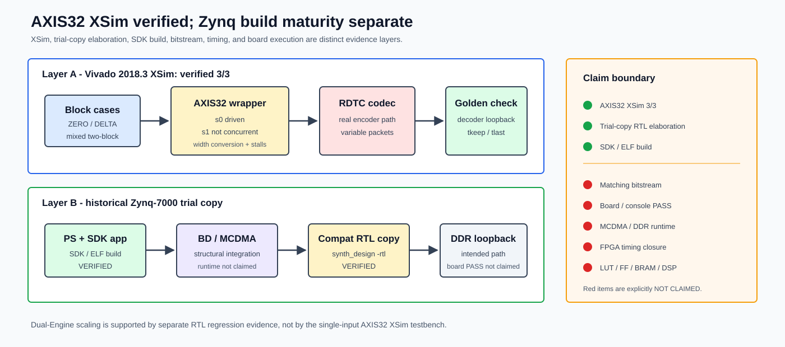

# 功能验证

[English](../en/verification.md)

## 验证链

RDTC 使用逐层收敛的验证链，而不是只依赖单一 RTL testbench：

| 层次 | 检查内容 | 公开成熟度 |
|---|---|---|
| MATLAB | synthetic 数据、模式趋势、向量生成、无损重构观察 | recorded synthetic study |
| C reference | packet、payload、`selected_k` 与解码结果的 bit-exact oracle | verified for published vectors |
| DPI-C / SystemVerilog | reference model 与 RTL 的逐 block 比较 | verified finite regression |
| RTL protocol | AXI backpressure、`tkeep/tlast`、多 block、loopback、malformed stream | verified finite regression |
| Multi-Engine RTL | 分发、独立 packet buffer、packet-locked arbitration、packet identity | verified finite workload |
| Bounded Direct-AXIS RTL | 两 block packet/selected-k 等价、`II=1` ring read、decoder loopback 与 fatal 边界 | verified finite regression |
| FPGA emulation simulation | 固定 commit 的单 active-input AXIS32 wrapper XSim | `3/3` cases verified |
| FPGA OOC implementation | `xc7z100ffg900-2` 上的 Direct-AXIS 双 Engine 结构与内部时序门禁 | fixed 200 MHz post-route point verified |
| 历史 Zynq build layers | trial-copy compatibility RTL elaboration 与 SDK/ELF build | 仅对应 build layer verified |

公开结果适用于记录的 source/configuration/vector 身份，不是形式穷尽证明、functional coverage closure 或所有参数组合的证明。

## Bit-exact 与协议检查

公开 legal-vector 覆盖 `RAW_BYPASS`、`ZERO_RICE`、`DELTA_RICE`、多 block、AXI packing、encoder-decoder loopback、输入间隙、随机输出 backpressure 与 malformed-stream 负向条件。核心 acceptance 条件包括：

- 解码后的 I/Q sample 与 reference 完全一致；
- `selected_k`、payload bit/byte count 和 compression choice 一致；
- 最后一个 beat 的 `tkeep/tlast` 正确；
- stall 前后 packet 内容和边界不变；
- 非法 header、mode 或长度能够产生明确错误状态。

MATLAB 脚本用于向量和算法 study；公开 C cross-check 的权威入口是：

```bash
make -C ref_model/c test
```

面向首次集成的最短可见路径是：

```bash
make codec-demo
```

它实际编译并调用同一公开 C encoder/decoder，在 ignored `build/showcase_codec_demo/` 中生成固定输入、360-byte packet 和解码输出，再按 tracked JSON 检查三者 SHA256 与 `RDTC_CODEC_DEMO_PASS`。该 quickstart 是 C reference integration demo，不替代 RTL regression。

MATLAB 页面中的 point-cloud comparison 不是 PointCloud RTL，也不是替代 C executable cross-check 的证据。

## Multi-Engine Regression

历史 fixed-commit 256-block prefix workload 检查 payload byte-exact、`selected_k`、压缩比、packet 完整性与无 beat interleaving。该记录把一个 beam 定义为 256 个 block，`beam/s` 由未舍入的 beam 总周期计算。性能结果为：

| Engines | Cycles/block | Scaling efficiency | Beam/s at assumed 200 MHz |
|---:|---:|---:|---:|
| 1 | 785 | baseline | - |
| 2 | 397.52 | 0.987368 | 1965.3022 |
| 4 | 197.41 | 0.994115 | 3957.4642 |

这些数字是 simulated DDR model 下的 RTL simulation projection，不是 FPGA 时序或板上吞吐。当前公开 adaptation 另有 2-Engine、2-block correctness smoke，以及 packet-buffer overlength fail-stop/reset recovery、双 slot 同周期 queue push/pop、单 slot turnover、completion 同周期状态清零和 `OUTPUT_IN_ORDER=1` fail-fast 边界测试，但不重算该性能矩阵。Arbiter 保证 packet atomic、无 beat interleaving，但完成顺序不保证。现有记录验证 block identity，没有直接观察到一次实际乱序事件；metadata 允许软件按 Frame/Block index 重建，不声明软件 reorder PASS。

公开 evidence 摘要与数据：[Multi-Engine evidence](../../evidence/rdtc_v1_multiengine_rtl.yaml) · [公开 CSV](../../evidence/data/rdtc_v1_multiengine_scaling.csv)

## Bounded Direct-AXIS Regression

Register profile 的 ModelSim regression 将两个完整 1024-sample block 严格按 Engine 0/1 轮转，检查 packet data、`tuser/tlast`、selected `k=[0,2]`、每个 Engine 256 个有序 ring-read request/response、两拍 request-to-response latency 与每拍一个 request。两个 packet 分别为 20 和 72 beat，Decoder 对两个 block 均 bit-exact 恢复。Normalized trace SHA256 记录在 [Direct RTL evidence](../../evidence/rdtc_v1_bounded_direct_rtl.yaml)。

负向测试覆盖非法 codec/Rice mode、descriptor 前数据、过早/过晚 `tlast`、129-bit Rice word、way conflict、output-credit 耗尽、sticky fatal 与 reset recovery。Direct filelist 的 68 个 RTL path 由 `make bounded-direct-rtl-identity-check` 与固定 evidence source 逐文件 byte-exact 比较。

长序列零间隔测试明确记录 scheduler 边界：有序 packet service 约 277 cycles，高于 256-cycle block arrival interval；随后出现的合法 way conflict 是预期架构限制，不是持续吞吐 PASS。

## FPGA Emulation

**FPGA emulation verified.** 在固定 source commit `43deb9f` 上，Vivado 2018.3 XSim 中的 AXIS32 wrapper `3/3` block-level cases 通过：ZERO_RICE、DELTA_RICE，以及 mixed two-block。检查覆盖真实 encoder path、decoder golden comparison、宽度转换、可变长 packet、`tkeep/tlast`、输入 gap 与输出 backpressure。当前公开 adaptation 另有 Icarus smoke，不构成新的 Vivado 结果。

该 AXIS32 testbench 只驱动 `s0`，不能作为双 Engine scaling 或双输入并发验证；该历史 profile 仍不声明 timing/resources。独立的 bounded Direct-AXIS top 在 `xc7z100ffg900-2` 上完成 Vivado 2022.2 OOC post-route 200 MHz，setup/hold WNS 为 `+0.001/+0.062 ns`，internal failing endpoint 为 0，资源为 `32,672 LUT / 18,519 FF / 0 BRAM`，8 个 way 内精确映射 `1024 x RAM32X1S`。这不证明 bitstream、板上运行、board IO timing、Fmax 或持续零间隔吞吐。

公开 evidence 摘要与数据：[XSim evidence](../../evidence/rdtc_v1_fpga_axis32_emulation.yaml) · [Direct OOC evidence](../../evidence/rdtc_v1_bounded_direct_fpga_ooc200.yaml) · [Zynq trial-build evidence](../../evidence/rdtc_v1_zynq_trial_build.yaml) · [XSim case CSV](../../evidence/data/rdtc_v1_fpga_axis32_xsim_cases.csv)



## 公开检查入口

```bash
make rdtc_v1_public_preflight_defconfig
make showconfig
make codec-demo
make -C ref_model/c test
make integration-smoke
make rtl-smoke
make multiengine-smoke
make fpga-wrapper-smoke
make bounded-direct-rtl-smoke
make bounded-direct-rtl-identity-check
make showcase-assets-check
```

在配置完整的 Questa/ModelSim 环境中，可运行：

```bash
make sim
make sim-full
make bounded-direct-register-modelsim-regression
```

工具存在、脚本可加载或工程可 elaboration 只证明对应层次，不自动提升为 implementation、timing、bitstream 或 board workload PASS。完整未声明项见[限制](limitations.md)。
